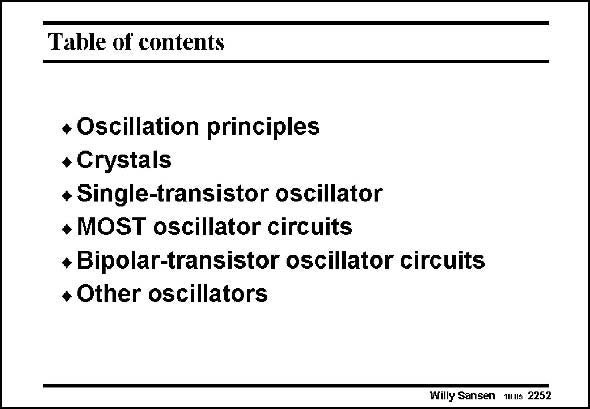

# SANSEN-2252 · Table of contents

章节：22 晶体振荡器设计  
PDF 页：692；书本页：703；幻灯片编号：2252  
状态：unreviewed



## 对应教材讲解

### PDF 692 · 书本 703

In this Chapter, the design of oscillators is discussed. Crystal oscillators have been discussed in great detail, followed by VCO’s and even Wien bridge oscillators. All of them obey the Barkhausen criteria however, which is the main theory behind them.

## 公式／性能结论候选摘录

以下为规则截取的原文，尚未逐项判读。

（未由规则找到；不代表原页没有此类内容。）

## 曲线结论候选摘录

以下为规则截取的原文，尚未逐项判读。

（未由规则找到；不代表原页没有此类内容。）

## 原文条件与近似候选摘录

以下为规则截取的原文，尚未逐项判读。

（未由规则找到；不代表原页没有此类内容。）

## 幻灯片 OCR（未校正）

```text
Table of contents
• Oscillation principles
• Crystals
+ Single-transistor oscillator
• MOST oscillator circuits
* Bipolar-transistor oscillator circuits
* Other oscillators
Willy Sansen 1ms 2252
```

数学上下标、分数及正负号以原图为准。电路图已保留；未核对的连接不输出成可仿真 netlist。
