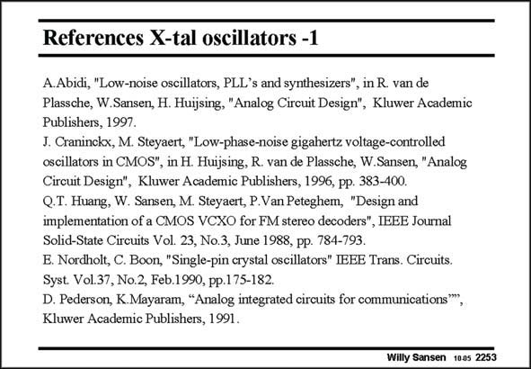

# SANSEN-2253 · References X-tal oscillators -1

章节：22 晶体振荡器设计  
PDF 页：693；书本页：704；幻灯片编号：2253  
状态：unreviewed



## 对应教材讲解

本页为参考文献幻灯片；已查看原 PDF，原页没有另外的正文讲解。

## 公式／性能结论候选摘录

以下为规则截取的原文，尚未逐项判读。

（未由规则找到；不代表原页没有此类内容。）

## 曲线结论候选摘录

以下为规则截取的原文，尚未逐项判读。

（未由规则找到；不代表原页没有此类内容。）

## 原文条件与近似候选摘录

以下为规则截取的原文，尚未逐项判读。

（未由规则找到；不代表原页没有此类内容。）

## 幻灯片 OCR（未校正）

```text
References X-tal oscillators -1
A.Abidi, "Low-noise oscillators, PLL's and synthesizers", in R. van de
Plassche, W.Sansen, H. Huijsing, "Analog Circuit Design", Kluwer Academic
Publishers, 1997.
J. Craninckx, M. Steyaert, "Low-phase-noise gigahertz voltage-controlled
oscillators in CMOS", in H. Huijsing, R. van de Plassche, W.Sansen, "Analog
Circuit Design", Kluwer Academic Publishers, 1996, pp. 383-400.
Q.T. Huang, W. Sansen, M. Steyaert, P.Van Peteghem, "Design and
implementation of a CMOS VCXO for FM stereo decoders", IBBE Journal
Solid-State Circuits Vol. 23, No.3, June 1988, pp. 784-793.
E. Nordholt, C. Boon, "Single-pin crystal oscillators" IEEE Trans. Circuits.
Syst. Vol.37, No.2, Feb.1990, pp.175-182.
D. Pederson, K.Mayaram, "Analog integrated circuits for communications"
Kluwer Academic Publishers, 1991.
Willy Sansen 1005 2253
```

数学上下标、分数及正负号以原图为准。电路图已保留；未核对的连接不输出成可仿真 netlist。
