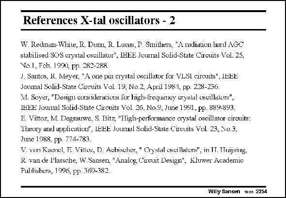

# SANSEN-2254 · References X-tal oscillators - 2

章节：22 晶体振荡器设计  
PDF 页：693；书本页：704；幻灯片编号：2254  
状态：unreviewed



## 对应教材讲解

本页为参考文献幻灯片；已查看原 PDF，原页没有另外的正文讲解。

## 公式／性能结论候选摘录

以下为规则截取的原文，尚未逐项判读。

（未由规则找到；不代表原页没有此类内容。）

## 曲线结论候选摘录

以下为规则截取的原文，尚未逐项判读。

（未由规则找到；不代表原页没有此类内容。）

## 原文条件与近似候选摘录

以下为规则截取的原文，尚未逐项判读。

（未由规则找到；不代表原页没有此类内容。）

## 幻灯片 OCR（未校正）

```text
References X-tal oscillators - 2
W. Redman-White, R. Dum, R. Lucas, P. Smithers, "A radiation hard AGC
stabilised SOS crystal oscillator', IBEE Journal Solid-State Circuits Vol. 25.
No. 1, Fch. 1990, pp. 2x2-288.
J. Santos, K. Mayer, "A one pin crystal oscillator for VLSl circuits", IEEE
Joumal Solid-State Circuits Vol. 19, No.2, April 19811, pp. 228-236.
M. Soyer, "Desigu considerations for high-lrequency crystal cweillators",
IEEE Journal Solid-State Circuits Vol. 26, No.S, June 1951, pp. 889-893
E. Vittoz, M. Degrauwe, S. Bitz, 'Tigh-performance crystal oscillator circuits:
Theory aud application", LEEE Joumal Solid-State Circuits Vol. 23, No.3,
June 1988, PP. 774-783
V. von Kuonel, F. Villor, D. Acbischer, " Chyslal escillalors", in TT. TTuijwing:
R. van de P'lassche, W.Sansen "Analog Circuit Design", Kluwer Academic
Publishers, 1996, pp. 369-382.
Willy Sansen mus 2254
```

数学上下标、分数及正负号以原图为准。电路图已保留；未核对的连接不输出成可仿真 netlist。
