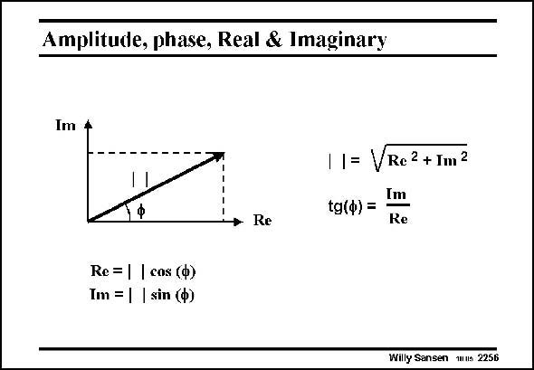

# SANSEN-2256 · Amplitude, phase, Real & Imaginary

章节：22 晶体振荡器设计  
PDF 页：694；书本页：705；幻灯片编号：2256  
状态：unreviewed



## 对应教材讲解

### PDF 694 · 书本 705

As a reminder to the reader, the relationship is given between amplitude and phase on one hand, and the Real and Imaginary part on the other hand. It is clear that complex numbers are situated in a plane. We always need two numbers to know where exactly they are. We can choose however, between amplitude and phase or the Real and Imaginary part! For example, the complex number (4,3) has a Real part of 4 and an Imaginary part of 3. Its amplitude is 5 and its phase is 0.64 radians or about 37°.

## 公式／性能结论候选摘录

以下为规则截取的原文，尚未逐项判读。

（未由规则找到；不代表原页没有此类内容。）

## 曲线结论候选摘录

以下为规则截取的原文，尚未逐项判读。

- PDF 694: As a reminder to the reader, the relationship is given between amplitude and phase on one hand, and the Real and Imaginary part on the other hand.
- PDF 694: We can choose however, between amplitude and phase or the Real and Imaginary part!
- PDF 694: Its amplitude is 5 and its phase is 0.64 radians or about 37°.

## 原文条件与近似候选摘录

以下为规则截取的原文，尚未逐项判读。

（未由规则找到；不代表原页没有此类内容。）

## 幻灯片 OCR（未校正）

```text
Amplitude, phase, Real & Imaginary
Im 4
• Re
1= VRe2+Im2
Im
tg(ф) =
Re
Re= | | cos (Ф)
Im = | | sin (Ф)
Willy Sansen mus 2256
```

数学上下标、分数及正负号以原图为准。电路图已保留；未核对的连接不输出成可仿真 netlist。
