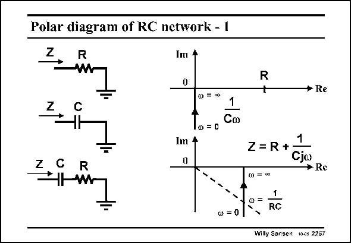

# SANSEN-2257 · Polar diagram of RC network - 1

章节：22 晶体振荡器设计  
PDF 页：695；书本页：706；幻灯片编号：2257  
状态：unreviewed



## 对应教材讲解

### PDF 695 · 书本 706

A simple resistor R is just one point on the Real axis. A simple capacitor C is on the negative part of the Imaginary axis, depending on the actual value of the frequency. For a frequency zero, it is infinitely far away but for a frequency infinity, it is in the zero of the axes. A series combination of a resistor R and a capacitor C, is also a straight line, but shifted over the Real axis by an amount R. At the circular frequency 1/RC, the point (locus) is at 45° with respect to the two axes.

## 公式／性能结论候选摘录

以下为规则截取的原文，尚未逐项判读。

- PDF 695: A simple capacitor C is on the negative part of the Imaginary axis, depending on the actual value of the frequency.

## 曲线结论候选摘录

以下为规则截取的原文，尚未逐项判读。

- PDF 695: A simple resistor R is just one point on the Real axis.
- PDF 695: A simple capacitor C is on the negative part of the Imaginary axis, depending on the actual value of the frequency.
- PDF 695: For a frequency zero, it is infinitely far away but for a frequency infinity, it is in the zero of the axes.
- PDF 695: A series combination of a resistor R and a capacitor C, is also a straight line, but shifted over the Real axis by an amount R.
- PDF 695: At the circular frequency 1/RC, the point (locus) is at 45° with respect to the two axes.

## 原文条件与近似候选摘录

以下为规则截取的原文，尚未逐项判读。

（未由规则找到；不代表原页没有此类内容。）

## 幻灯片 OCR（未校正）

```text
Polar diagram of RC network - 1
2
R
Im 4
0
Z
C
0 =∞
1
1o=0
Co
Im 4
0
R
W
u) = 0
R
+
* Re
1
Z = R+
Cjo
→ Re
@ =0
0 =
RC
Willy Sansen 1065 2267
```

数学上下标、分数及正负号以原图为准。电路图已保留；未核对的连接不输出成可仿真 netlist。
