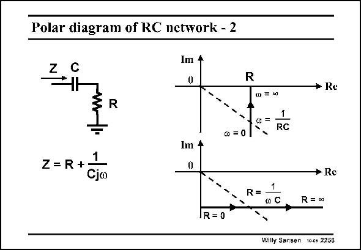

# SANSEN-2258 · Polar diagram of RC network - 2

章节：22 晶体振荡器设计  
PDF 页：695；书本页：706；幻灯片编号：2258  
状态：unreviewed



## 对应教材讲解

### PDF 695 · 书本 706

The same impedance can also be plotted with resistor R as a parameter, rather than the frequency. A different locus results. It shares the same point at frequency 1/RC but is now a horizontal line through this point. For zero resistor, it is on the axis, but obviously goes to infinity for infinite resistor.

## 公式／性能结论候选摘录

以下为规则截取的原文，尚未逐项判读。

（未由规则找到；不代表原页没有此类内容。）

## 曲线结论候选摘录

以下为规则截取的原文，尚未逐项判读。

- PDF 695: The same impedance can also be plotted with resistor R as a parameter, rather than the frequency.
- PDF 695: For zero resistor, it is on the axis, but obviously goes to infinity for infinite resistor.

## 原文条件与近似候选摘录

以下为规则截取的原文，尚未逐项判读。

（未由规则找到；不代表原页没有此类内容。）

## 幻灯片 OCR（未校正）

```text
Polar diagram of RC network - 2
Z
Im +
0
R
* Re
R
0 = 0
1
•=01°
RC
Z=R+1
Cjo
Im 4
0
R=
o C
* Re
R =a
IR = 0
Willy Sansen toes 2258
```

数学上下标、分数及正负号以原图为准。电路图已保留；未核对的连接不输出成可仿真 netlist。
