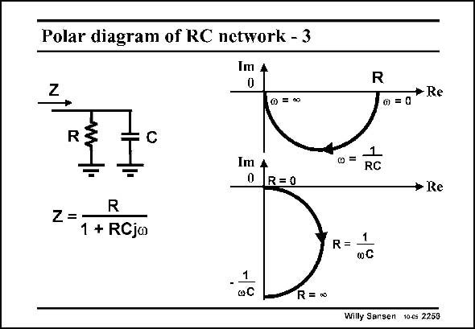

# SANSEN-2259 · Polar diagram of RC network - 3

章节：22 晶体振荡器设计  
PDF 页：696；书本页：707；幻灯片编号：2259  
状态：unreviewed



## 对应教材讲解

### PDF 696 · 书本 707

A parallel combination of a resistor and a capacitor gives an impedance which yields a half circle in the complex plane. In the top one, the frequency is used as a parameter. For zero frequency, the impedance of the capacitor is infinite and thus disappears from the picture. The impedance is now just a resistor R. For infinite frequency, the impedance is zero and therefore in the zero (or origin) of the axes. At circle frequency 1/RC, the locus is at 45° with respect to the two axes, or at the bottom of the circle. If the resistor is taken as a parameter, a different half circle is described by the impedance. They go through the same point at RCv=1. For zero resistor, the locus is at the origin of the axes. For infinite resistor, we just have a capacitor, which is located on the Imaginary axis.

## 公式／性能结论候选摘录

以下为规则截取的原文，尚未逐项判读。

- PDF 696: For zero frequency, the impedance of the capacitor is infinite and thus disappears from the picture.
- PDF 696: For infinite frequency, the impedance is zero and therefore in the zero (or origin) of the axes.

## 曲线结论候选摘录

以下为规则截取的原文，尚未逐项判读。

- PDF 696: For infinite frequency, the impedance is zero and therefore in the zero (or origin) of the axes.
- PDF 696: At circle frequency 1/RC, the locus is at 45° with respect to the two axes, or at the bottom of the circle.
- PDF 696: For zero resistor, the locus is at the origin of the axes.
- PDF 696: For infinite resistor, we just have a capacitor, which is located on the Imaginary axis.

## 原文条件与近似候选摘录

以下为规则截取的原文，尚未逐项判读。

（未由规则找到；不代表原页没有此类内容。）

## 幻灯片 OCR（未校正）

```text
Polar diagram of RC network - 3
Im
0
R
4
@ = 00
+ Re
0 =0
R
C
Im
0
1
RC
R=0
+ Re
R
Z =
1 + RCjo
R= 1
.1
a C
R= 0
Willy Sansen toes 2250
```

数学上下标、分数及正负号以原图为准。电路图已保留；未核对的连接不输出成可仿真 netlist。
