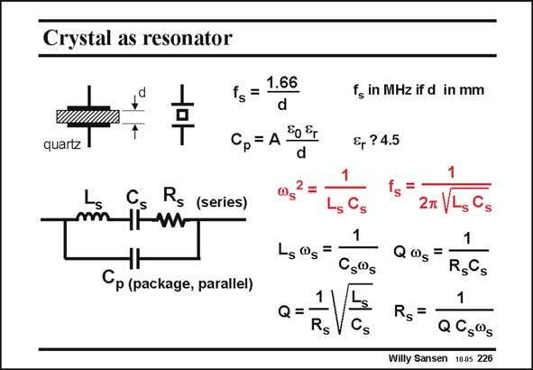

# SANSEN-226 · Crystal as resonator

章节：22 晶体振荡器设计  
PDF 页：668；书本页：679；幻灯片编号：226  
状态：unreviewed



## 对应教材讲解

### PDF 668 · 书本 679

A crystal consists of a plate of piezoresistive material with a certain thickness d. Piezoresistive material allows exchange of mechanical and electrical energy. Examples are quartz and ZnO and some nitrides. Application of a mechanical pressure to it, generates a voltage across it and vice versa. This exchange of energy is particularly efficient at one particular frequency, called the resonant frequency f . This frequency is inversely proportional to the thickness of the quartz. Values of s 100 kHz to 40–50 MHz are commonly fabricated. For higher values, the quartz becomes too thin and fragile. Around this resonant frequency the electrical model of this crystal is a series resonant LRC circuit, the resonant frequency of which is f . It is damped by the series resistor R , which causes s s the quality factor Q to be finite. All relevant expressions are given in this slide. Note that at resonance, the impedance of the inductor equals that of the capacitance. Actually, at resonance the series RLC circuit is just R , itself. The inductor L and capacitor C cancel s s s each other. In addition to this series RLC circuit, which represents the electro-mechanical operation of the crystal, a plate capacitance C has to be added. It is the capacitance between the two plates p

### PDF 669 · 书本 680

used to contact the crystal, with the dielectric constant of quartz (4.5 times larger than air). It includes the package and mounting capacitances as well.

## 公式／性能结论候选摘录

以下为规则截取的原文，尚未逐项判读。

- PDF 668: This frequency is inversely proportional to the thickness of the quartz.
- PDF 668: Note that at resonance, the impedance of the inductor equals that of the capacitance.

## 曲线结论候选摘录

以下为规则截取的原文，尚未逐项判读。

（未由规则找到；不代表原页没有此类内容。）

## 原文条件与近似候选摘录

以下为规则截取的原文，尚未逐项判读。

（未由规则找到；不代表原页没有此类内容。）

## 幻灯片 OCR（未校正）

```text
Crystal as resonator
quartz
Cs
T
1.66
fs =
d
Ср= A 0%
Rs (series)
-s®s
Cp (package, parallel)
Q =
f in MHz if d in mm
s,?4.5
Cs@s
Cs
2m
Q0s
1
RgGs
Rs=
1
QCs@s
Willy Sansen 1005 226
```

数学上下标、分数及正负号以原图为准。电路图已保留；未核对的连接不输出成可仿真 netlist。
