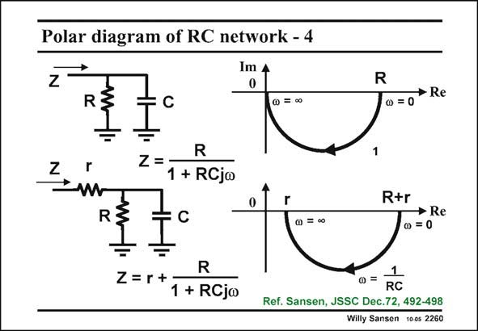

# SANSEN-2260 · Polar diagram of RC network - 4

章节：22 晶体振荡器设计  
PDF 页：696；书本页：707；幻灯片编号：2260  
状态：unreviewed



## 对应教材讲解

### PDF 696 · 书本 707

Addition of a resistor r to the parallel combination of R and C, causes the half circle to shift to the right, over a distance r, at least if the frequency is taken as a parameter. This is a well known polar plot, as it is similar to the input impedance of a bipolar single-transistor amplifier. It is also called the circle diagram. Measurement of the input impedance versus frequency, allows tracing a circle through the data, which yields values for R, r and 1/RC.

## 公式／性能结论候选摘录

以下为规则截取的原文，尚未逐项判读。

（未由规则找到；不代表原页没有此类内容。）

## 曲线结论候选摘录

以下为规则截取的原文，尚未逐项判读。

- PDF 696: This is a well known polar plot, as it is similar to the input impedance of a bipolar single-transistor amplifier.

## 原文条件与近似候选摘录

以下为规则截取的原文，尚未逐项判读。

（未由规则找到；不代表原页没有此类内容。）

## 幻灯片 OCR（未校正）

```text
Polar diagram of RC network - 4
Im 4
Z
0
R
R
@ =00
• Re
0 =0
N
Z =
R
1 + RCjo
R:
0
r
R+r
• Re
0=0
R
Z=r+
1 + RCjw
1
RC
Ref. Sansen, JSSC Dec.72, 492-498
Willy Sansen 100s 2260
```

数学上下标、分数及正负号以原图为准。电路图已保留；未核对的连接不输出成可仿真 netlist。
