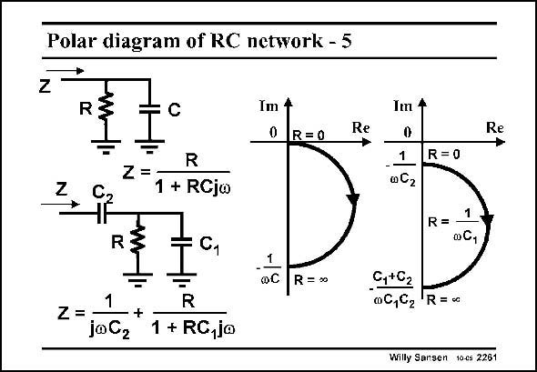

# SANSEN-2261 · Polar diagram of RC network - 5

章节：22 晶体振荡器设计  
PDF 页：697；书本页：708；幻灯片编号：2261  
状态：unreviewed



## 对应教材讲解

### PDF 697 · 书本 708

In a similar way, addition of a capacitor C to the paral- 2 lel combination of R and C , 1 causes the half circle to shift on the Imaginary axis, over a distance C , at least if 2 the resistor is taken as a parameter. For a zero resistor, we simply have capacitor C 2 left. For an infinite resistor however, both capacitances are in series. Again measurement of the input impedance versus frequency, allows tracing a circle through the data, which yields values for R, C and C . 1 2

## 公式／性能结论候选摘录

以下为规则截取的原文，尚未逐项判读。

（未由规则找到；不代表原页没有此类内容。）

## 曲线结论候选摘录

以下为规则截取的原文，尚未逐项判读。

- PDF 697: In a similar way, addition of a capacitor C to the paral- 2 lel combination of R and C , 1 causes the half circle to shift on the Imaginary axis, over a distance C , at least if 2 the resistor is taken as a parameter.

## 原文条件与近似候选摘录

以下为规则截取的原文，尚未逐项判读。

（未由规则找到；不代表原页没有此类内容。）

## 幻灯片 OCR（未校正）

```text
Polar diagram of RC network - 5
Z
R
Im 4
0 R=0
Im +
Re
Re
C
R
Z =
1 + RCj∞
1
0C2
R=0
R=
R
C1
oC,
1
R = 30
C,+02
-
0C,92
Z =
+
joCz
R
1 + RC,jo
R=•c
Willy Sansen toes 2281
```

数学上下标、分数及正负号以原图为准。电路图已保留；未核对的连接不输出成可仿真 netlist。
