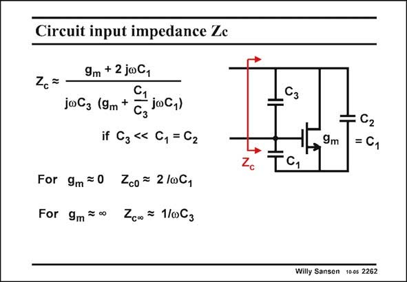

# SANSEN-2262 · Circuit input impedance Ze

章节：22 晶体振荡器设计  
PDF 页：697；书本页：708；幻灯片编号：2262  
状态：unreviewed



## 对应教材讲解

### PDF 697 · 书本 708

The question now is, what is the locus of the input impedance Z with g as a c m parameter? The approximate expression is readily calculated and given in this slide. Also the values at zero and infinite transconductance are easily found. The corresponding polar diagram is given on the next slide.

## 公式／性能结论候选摘录

以下为规则截取的原文，尚未逐项判读。

（未由规则找到；不代表原页没有此类内容。）

## 曲线结论候选摘录

以下为规则截取的原文，尚未逐项判读。

（未由规则找到；不代表原页没有此类内容。）

## 原文条件与近似候选摘录

以下为规则截取的原文，尚未逐项判读。

- PDF 697: The approximate expression is readily calculated and given in this slide.

## 幻灯片 OCR（未校正）

```text
Circuit input impedance Ze
9m + 2 joC,
jwCz (9m+
Сз
joC1)
if C3 < C,=C2
For 9m=0 Zc0= 2/001
For 9m= Zc0o= 1/063
Сз
9m
=C1
Willy Sansen 100s 2262
```

数学上下标、分数及正负号以原图为准。电路图已保留；未核对的连接不输出成可仿真 netlist。
