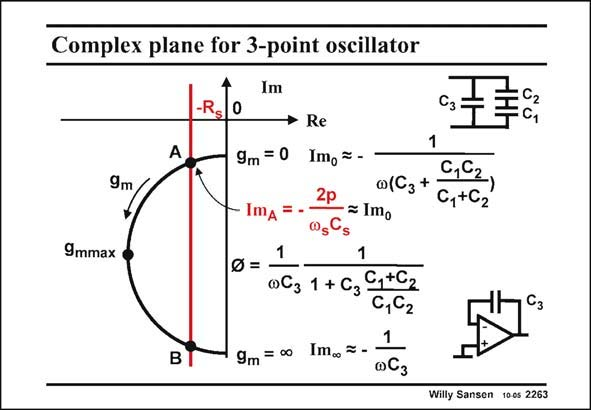

# SANSEN-2263 · Complex plane for 3-point oscillator

章节：22 晶体振荡器设计  
PDF 页：698；书本页：709；幻灯片编号：2263  
状态：unreviewed



## 对应教材讲解

### PDF 698 · 书本 709

The polar plot of impedance Z with g as a parameter, c m is again a half circle. It is on the left side of the Imaginary axis however, because it presents a negative Real part. For zero g , we simply m have a combination of the three capacitors. For increasing g , the half circle m is described until the locus hits the imaginary axis again, for infinite g . The m capacitor is now only C , 3 however. The diameter of the circle is easily derived from its two extremities. When used for an oscillator, only one point is of importance, i.e. point A. It is the point where the negative Real part equals resistor R . The Imaginary Part Im in point A then yields the s A pulling factor p. It is about the same as the Imaginary part Im for zero g . The line of constant 0 m negative R is actually much closer to the Imaginary axis than sketched. Point A therefore nearly s lies on the Imaginary axis!

## 公式／性能结论候选摘录

以下为规则截取的原文，尚未逐项判读。

- PDF 698: It is the point where the negative Real part equals resistor R .
- PDF 698: Point A therefore nearly s lies on the Imaginary axis!

## 曲线结论候选摘录

以下为规则截取的原文，尚未逐项判读。

- PDF 698: The polar plot of impedance Z with g as a parameter, c m is again a half circle.
- PDF 698: It is on the left side of the Imaginary axis however, because it presents a negative Real part.
- PDF 698: For increasing g , the half circle m is described until the locus hits the imaginary axis again, for infinite g .
- PDF 698: The line of constant 0 m negative R is actually much closer to the Imaginary axis than sketched.
- PDF 698: Point A therefore nearly s lies on the Imaginary axis!

## 原文条件与近似候选摘录

以下为规则截取的原文，尚未逐项判读。

（未由规则找到；不代表原页没有此类内容。）

## 幻灯片 OCR（未校正）

```text
Complex plane for 3-point oscillator
Im
-Rs
0
Сз
9m
9m = 0
ImA
9mmax
B
9m = ∞•
• Re
1
Imo = -
0,62
2p
0(C3+
≥ Imo
C,+C2
1
1
∞C3
1 + С3
C,+C2
0,C2
1
Im. = -
0C3
Willy Sansen 100s 2263
```

数学上下标、分数及正负号以原图为准。电路图已保留；未核对的连接不输出成可仿真 netlist。
