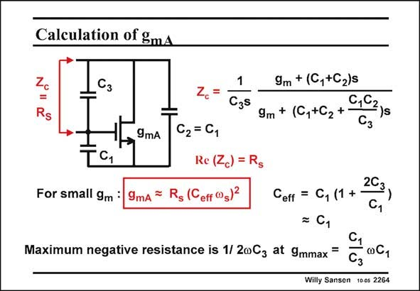

# SANSEN-2264 · Calculation of gmA

章节：22 晶体振荡器设计  
PDF 页：698；书本页：709；幻灯片编号：2264  
状态：unreviewed



## 对应教材讲解

### PDF 698 · 书本 709

In order to find the actual value of g in point A, we mA have to equate the Real part of impedance Z to the resisc tor R itself. s For small values of R (= 1 R ) the transconductance 2 g will be small. It can then mA be approximated as given in this slide. It is in a frame as it is the most basic expression of the required transconductance of any singletransistor amplifier. It shows why RF oscillators require a large amount of current! From the same expression of Z , we can derive what is the expression of g , which is c mmax reached at the utmost left point of the circle. This is the point where the negative Real part is maximum.

## 公式／性能结论候选摘录

以下为规则截取的原文，尚未逐项判读。

（未由规则找到；不代表原页没有此类内容。）

## 曲线结论候选摘录

以下为规则截取的原文，尚未逐项判读。

（未由规则找到；不代表原页没有此类内容。）

## 原文条件与近似候选摘录

以下为规则截取的原文，尚未逐项判读。

- PDF 698: It can then mA be approximated as given in this slide.

## 幻灯片 OCR（未校正）

```text
Calculation of gmA
Сз
1
Czs
9m + (C,+C2)s
C,C
9m + (C,+C2+
S
9mA
C2= C1
Re (Zc) = Rg
9mA = R, (Ceff °g)2
For small gm
Maximum negative resistance is 1/ 20Cz at 9mmax =
2C3
Ceff = C, (1 +
= C1
C,
Сз
0C1
Willy Sansen 1005 2264
```

数学上下标、分数及正负号以原图为准。电路图已保留；未核对的连接不输出成可仿真 netlist。
