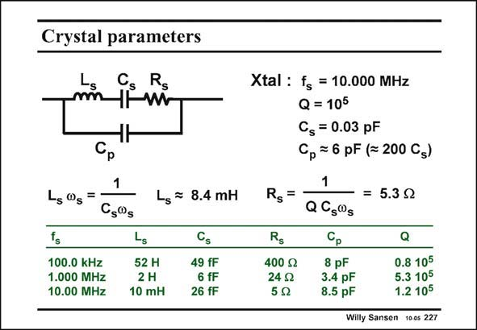

# SANSEN-227 · Crystal parameters

章节：22 晶体振荡器设计  
PDF 页：669；书本页：680；幻灯片编号：227  
状态：unreviewed



## 对应教材讲解

### PDF 669 · 书本 680

For example, a crystal of 10.00 MHz can be modeled by a series LRC with an inductance of about 10 mH in series with 26 fF and a damping resistor of 5 V. Note that the inductors are fairly large and the capacitors very small. A rule of thumb says that they are about 1/200 to 1/250 of the package capacitance C . p Plate or package capacitances are always of the order of magnitude of pF’s. The series capacitance C is s always in the fF range. The resistors are very small because the quality factors Q are so high, of the order of 105! It is clear that the package capacitance C also forms a parallel resonant circuit with L . We p s have both a series and a parallel resonant circuit! We will try to make an oscillator at the series resonant frequency f however, as this is the s internal crystal frequency, independent of the package or mounting.

## 公式／性能结论候选摘录

以下为规则截取的原文，尚未逐项判读。

- PDF 669: We will try to make an oscillator at the series resonant frequency f however, as this is the s internal crystal frequency, independent of the package or mounting.

## 曲线结论候选摘录

以下为规则截取的原文，尚未逐项判读。

（未由规则找到；不代表原页没有此类内容。）

## 原文条件与近似候选摘录

以下为规则截取的原文，尚未逐项判读。

（未由规则找到；不代表原页没有此类内容。）

## 幻灯片 OCR（未校正）

```text
Crystal parameters
Cs
Rg
-HW
Ls @g
100.0 kHz
1.000 MHz
10.00 MHz
1
650g
Ls
52 H
2 H
10 mH
Ls * 8.4 mH
Cs
49 fF
6 fF
26 fF
Xtal : fg = 10.000 MHz
Q = 105
Cs = 0.03 pF
Cp = 6 pF (= 200 Gs)
1
Rg
=
= 5.39
QGs00s
Rg
400 g
24 9
50
8 pF
3.4 pF
8.5 pF
Q
0.8 105
5.3 105
1.2 105
Willy Sansen 100s 227
```

数学上下标、分数及正负号以原图为准。电路图已保留；未核对的连接不输出成可仿真 netlist。
