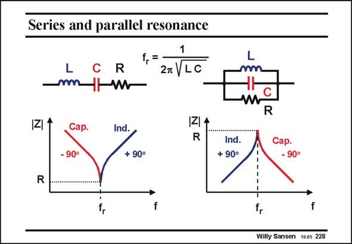

# SANSEN-228 · Series and parallel resonance

章节：22 晶体振荡器设计  
PDF 页：669；书本页：680；幻灯片编号：228  
状态：unreviewed



## 对应教材讲解

### PDF 669 · 书本 680

To recall what series and parallel resonance means, both are sketched in this slide. Both have the same expression for the resonant frequency f . r The impedances versus frequency look very, different however. A series resonant circuit has a sharp null at resonance. At resonance the impedance is reduced to the resistor R. The crystal is purely resistive. For frequencies lower than f , the impedance of the capacitor increases and therefore determines the current. The r impedance is capacitive, and the phase becomes −90°. For higher frequencies, the impedance

### PDF 670 · 书本 681

turns inductive, and its phase 90°. A parallel resonant circuit has a sharp peak at resonance. At resonance, the impedance is limited by the resistor R. The crystal is again purely resistive. For frequencies lower than f , the impedance of the inductor decreases and therefore determines r the current. The impedance is inductive, and the phase becomes 90°. For higher frequencies, the impedance turns capacitive, and its phase −90°. This is exactly the opposite compared to a series resonant circuit.

## 公式／性能结论候选摘录

以下为规则截取的原文，尚未逐项判读。

- PDF 669: For frequencies lower than f , the impedance of the capacitor increases and therefore determines the current.
- PDF 670: At resonance, the impedance is limited by the resistor R.
- PDF 670: For frequencies lower than f , the impedance of the inductor decreases and therefore determines r the current.

## 曲线结论候选摘录

以下为规则截取的原文，尚未逐项判读。

- PDF 669: The r impedance is capacitive, and the phase becomes −90°.
- PDF 670: turns inductive, and its phase 90°.
- PDF 670: A parallel resonant circuit has a sharp peak at resonance.
- PDF 670: The impedance is inductive, and the phase becomes 90°.
- PDF 670: For higher frequencies, the impedance turns capacitive, and its phase −90°.

## 原文条件与近似候选摘录

以下为规则截取的原文，尚未逐项判读。

（未由规则找到；不代表原页没有此类内容。）

## 幻灯片 OCR（未校正）

```text
Series and parallel resonance
L
mm.
R
f,=
2m V LC
IZ
Cap.
- 90°
Ind.
1Z4
R
+ 90°
R
f
L
w
C
R
Ind.
+ 90°
Caр.
- 90°
Willy Sansen 1005 228
```

数学上下标、分数及正负号以原图为准。电路图已保留；未核对的连接不输出成可仿真 netlist。
