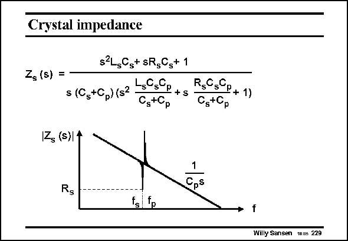

# SANSEN-229 · Crystal impedance

章节：22 晶体振荡器设计  
PDF 页：670；书本页：681；幻灯片编号：229  
状态：unreviewed



## 对应教材讲解

### PDF 670 · 书本 681

Let us now return to the crystal and plot its impedance versus frequency. It is given in this slide. It is clearly described by a third-order expression and is plotted below. In general it shows the impedance of the package capacitor C . It decreases p with frequency indeed. Around the resonant frequency, we notice a null and a peak however, very close together. The null comes first and will represent the series resonance with resonant frequency f , whereas the peak will represent the parallel resonance. s Let us zoom in, in this region.

## 公式／性能结论候选摘录

以下为规则截取的原文，尚未逐项判读。

- PDF 670: It decreases p with frequency indeed.

## 曲线结论候选摘录

以下为规则截取的原文，尚未逐项判读。

- PDF 670: Let us now return to the crystal and plot its impedance versus frequency.
- PDF 670: It is clearly described by a third-order expression and is plotted below.
- PDF 670: Around the resonant frequency, we notice a null and a peak however, very close together.
- PDF 670: The null comes first and will represent the series resonance with resonant frequency f , whereas the peak will represent the parallel resonance. s Let us zoom in, in this region.

## 原文条件与近似候选摘录

以下为规则截取的原文，尚未逐项判读。

（未由规则找到；不代表原页没有此类内容。）

## 幻灯片 OCR（未校正）

```text
Crystal impedance
Zs (s) =
s2L5Cs+ sRgCs+ 1
s (Gg+Gp) (s3
Ls0sGp +s
R,0,0p + 1)
CstCp
CstCp
Z (s)| 1
1
Cps
Rg
fg p
f
Willy Sansen mns 229
```

数学上下标、分数及正负号以原图为准。电路图已保留；未核对的连接不输出成可仿真 netlist。
