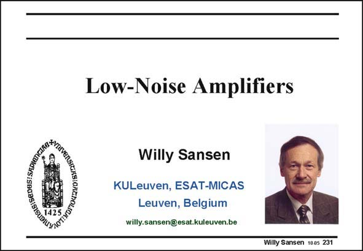

# SANSEN-231 · Slide 231

章节：23 低噪声放大器  
PDF 页：699；书本页：711；幻灯片编号：231  
状态：unreviewed



## 对应教材讲解

### PDF 699 · 书本 711

Low-noise amplifiers (LNA’s) are the first amplifiers in receivers. They must operate at the same high frequencies as the carriers themselves. For GSM, CDMA, etc., these frequencies are beyond 1 GHz, reaching 5 GHz today. In car electronics, frequencies are reached beyond tens of GHz. Moreover, such an amplifier must be able to handle very small signals close to the noise level and at the same time very high signal levels, close to the transmitter antenna. Noise and distortion are both of importance at the same time. Finally, the reception antenna is usually connected to the amplifier over a transmission line, usually with 50 V characteristic impedance. Such an amplifier is full of compromises, despite its low count of transistors. Indeed, only a few MOSTs are normally used. In this Chapter, these compromises will be discussed. Design equations and guide lines will be given and checked on their accuracy.

## 公式／性能结论候选摘录

以下为规则截取的原文，尚未逐项判读。

（未由规则找到；不代表原页没有此类内容。）

## 曲线结论候选摘录

以下为规则截取的原文，尚未逐项判读。

- PDF 699: Finally, the reception antenna is usually connected to the amplifier over a transmission line, usually with 50 V characteristic impedance.

## 原文条件与近似候选摘录

以下为规则截取的原文，尚未逐项判读。

（未由规则找到；不代表原页没有此类内容。）

## 幻灯片 OCR（未校正）

```text
gIS:SEDES: SA0I0),
Low-Noise Amplifiers
Willy Sansen
KULeuven, ESAT-MICAS
Leuven, Belgium
willy.sansen@esat.kuleuven.be
Willy Sansen 1005 231
```

数学上下标、分数及正负号以原图为准。电路图已保留；未核对的连接不输出成可仿真 netlist。
