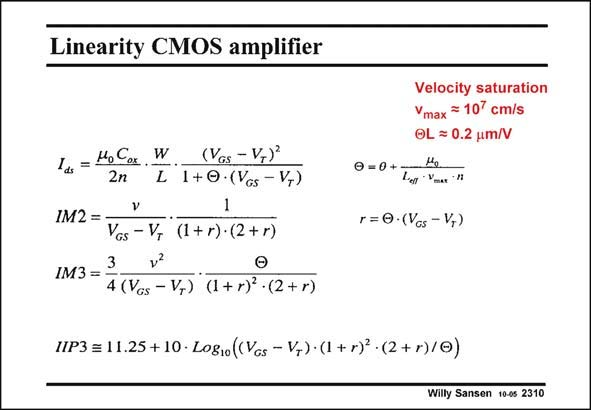

# SANSEN-2310 · Linearity CMOS amplifier

章节：23 低噪声放大器  
PDF 页：704；书本页：716；幻灯片编号：2310  
状态：unreviewed



## 对应教材讲解

### PDF 704 · 书本 716

The expression of the current I of a MOST has to DS be taken for high V −V . GS T This means that the fitting parameter H must be added to model the linearization of the I −V characteristic, DS GS as a result of mainly velocity saturation. The second and third derivatives of this expressions give rise to the IM2 and IM3 intermodulation expressions. From the latter one the IIP3 is readily derived. The IIP3 depends to a large extent on the choice of the V −V , as shown next. GS T

## 公式／性能结论候选摘录

以下为规则截取的原文，尚未逐项判读。

- PDF 704: GS T This means that the fitting parameter H must be added to model the linearization of the I −V characteristic, DS GS as a result of mainly velocity saturation.
- PDF 704: The IIP3 depends to a large extent on the choice of the V −V , as shown next.

## 曲线结论候选摘录

以下为规则截取的原文，尚未逐项判读。

- PDF 704: GS T This means that the fitting parameter H must be added to model the linearization of the I −V characteristic, DS GS as a result of mainly velocity saturation.

## 原文条件与近似候选摘录

以下为规则截取的原文，尚未逐项判读。

- PDF 704: GS T This means that the fitting parameter H must be added to model the linearization of the I −V characteristic, DS GS as a result of mainly velocity saturation.

## 幻灯片 OCR（未校正）

```text
Linearity CMOS amplifier
145 = Мо Сок ..
L
(Vos - V+)
1+0 •(VGs - V+)
v
IM2 =-
VGs - V,
(1+ r) •(2 + r)
3
IM3 =
4 (Vcs - V,) (1+ r)' - (2 + r)
Velocity saturation
Ymax = 107 cm/s
OL = 0.2 um/V
0= 0 + Lun Va "
r=0•(Vcs - V+)
IIP3 = 11.25 + 10 • Logio((Vos - V,)• (1 + r) • (2+ r)/0)
Willy Sansen 10-0s 2310
```

数学上下标、分数及正负号以原图为准。电路图已保留；未核对的连接不输出成可仿真 netlist。
