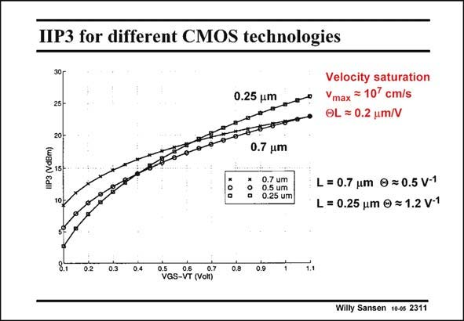

# SANSEN-2311 · IP3 for different CMOS technologies

章节：23 低噪声放大器  
PDF 页：704；书本页：716；幻灯片编号：2311  
状态：unreviewed



## 对应教材讲解

### PDF 704 · 书本 716

The IIP3 is plotted versus the value of V −V GS T for different CMOS technologies. It is clear that the higher the V −V , the higher the GS T IIP3 is but in a nonlinear way. It is also clear that for a V −V of 0.5 V, 15 dBm GS T IIP3 is readily available, independently of the technology. At V −V of 0.2 V, the GS T older CMOS technology provides the best IIP3. This is a result of the ever stronger effect of velocity saturation (parameter H) in deeper submicron technologies.

## 公式／性能结论候选摘录

以下为规则截取的原文，尚未逐项判读。

（未由规则找到；不代表原页没有此类内容。）

## 曲线结论候选摘录

以下为规则截取的原文，尚未逐项判读。

- PDF 704: The IIP3 is plotted versus the value of V −V GS T for different CMOS technologies.

## 原文条件与近似候选摘录

以下为规则截取的原文，尚未逐项判读。

- PDF 704: This is a result of the ever stronger effect of velocity saturation (parameter H) in deeper submicron technologies.

## 幻灯片 OCR（未校正）

```text
IP3 for different CMOS technologies
0.25 um
Velocity saturation
Vmax = 107 cm/s
OL = 0.2 um/V
IIP3 (VdBm)
0.7 um
0.7 um
0.5 um
0.25 um
L = 0.7 um 0 = 0.5 V-1
L = 0.25 um © = 1.2 V-1
02
0.3
0.8|
0.9
(Volt)
Willy Sansen 10-0s 2311
```

数学上下标、分数及正负号以原图为准。电路图已保留；未核对的连接不输出成可仿真 netlist。
