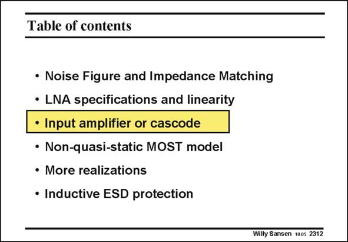

# SANSEN-2312 · Table of contents

章节：23 低噪声放大器  
PDF 页：705；书本页：717；幻灯片编号：2312  
状态：unreviewed



## 对应教材讲解

### PDF 705 · 书本 717

Now that the input impedance matching, the Noise Figure and IIP3 have been introduced, they all have to be derived for various circuit configuration. At these high frequencies, only simple circuits can be used. A single transistor amplifier is used more often, followed by a cascode amplifier. This is why they are discussed first.

## 公式／性能结论候选摘录

以下为规则截取的原文，尚未逐项判读。

（未由规则找到；不代表原页没有此类内容。）

## 曲线结论候选摘录

以下为规则截取的原文，尚未逐项判读。

（未由规则找到；不代表原页没有此类内容。）

## 原文条件与近似候选摘录

以下为规则截取的原文，尚未逐项判读。

（未由规则找到；不代表原页没有此类内容。）

## 幻灯片 OCR（未校正）

```text
Table of contents
• Noise Figure and Impedance Matching
• LNA specifications and linearity
• Input amplifier or cascode
• Non-quasi-static MOST model
• More realizations
• Inductive ESD protection
Willy Sansen 1005 2312
```

数学上下标、分数及正负号以原图为准。电路图已保留；未核对的连接不输出成可仿真 netlist。
