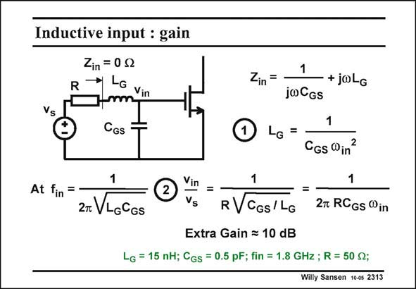

# SANSEN-2313 · Inductive input : gain

章节：23 低噪声放大器  
PDF 页：705；书本页：717；幻灯片编号：2313  
状态：unreviewed



## 对应教材讲解

### PDF 705 · 书本 717

A single-MOST amplifier is shown in this slide. Its equivalent input noise voltage source is added. A series inductor L is G added to tune out the effect of the input capacitance C . This inductor has been GS selected so that the operating frequency v fulfills the in expression labeled 1. This is the first design equation. At this frequency f , the in ratio of Gate voltage v to in the signal voltage v is reads ily calculated as given in this slide. It is clear that some gain can easily be realized, provided the input capacitance C is GS sufficiently small (for a given standard R), or the added inductance L sufficiently large. This is G the second design equation. Note that, the input capacitance C is effectively tuned out such that the input impedance GS Z is ideally zero. in

## 公式／性能结论候选摘录

以下为规则截取的原文，尚未逐项判读。

- PDF 705: It is clear that some gain can easily be realized, provided the input capacitance C is GS sufficiently small (for a given standard R), or the added inductance L sufficiently large.

## 曲线结论候选摘录

以下为规则截取的原文，尚未逐项判读。

（未由规则找到；不代表原页没有此类内容。）

## 原文条件与近似候选摘录

以下为规则截取的原文，尚未逐项判读。

- PDF 705: It is clear that some gain can easily be realized, provided the input capacitance C is GS sufficiently small (for a given standard R), or the added inductance L sufficiently large.

## 幻灯片 OCR（未校正）

```text
Inductive input : gain
Zin = 0 0
Zin =
Vs
CGS
1
+joLG
jwCGs
1
LG =-
CGs Win
=
1
At fin
=
2t VLOGGS
Vin
Vs
=
RVCGs/ LG
27 RCGs Win
Extra Gain = 10 dB
LG = 15 nH; CGs = 0.5 pF; fin = 1.8 GHz ; R = 50 0;
Willy Sansen 10-0s 2313
```

数学上下标、分数及正负号以原图为准。电路图已保留；未核对的连接不输出成可仿真 netlist。
