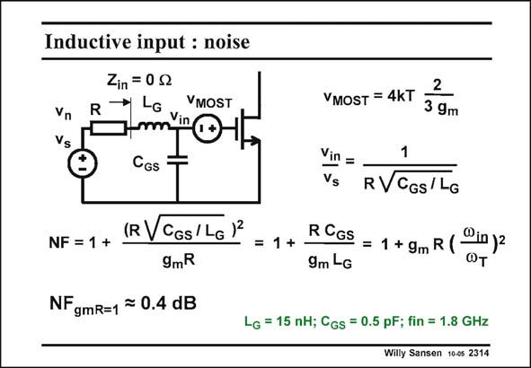

# SANSEN-2314 · Inductive input : noise

章节：23 低噪声放大器  
PDF 页：706；书本页：718；幻灯片编号：2314  
状态：unreviewed



## 对应教材讲解

### PDF 706 · 书本 718

The single-MOST amplifier is shown again in this slide. Its equivalent input noise voltage source v is MOST added. The Noise Figure is now readily calculated. It can be rewritten in terms of the several parameters involved. The last expression shows that for low NF the f of the T MOST must be made high. This means that, first of all, the MOST must be selected and then the corresponding inductor L . For high f the G T channel length must be as small as possible and its V −V high (see Chapter 1). GS T The Noise Figure is determined by this choice. This is the third design equation. No additional independent design parameters are present.

## 公式／性能结论候选摘录

以下为规则截取的原文，尚未逐项判读。

- PDF 706: No additional independent design parameters are present.

## 曲线结论候选摘录

以下为规则截取的原文，尚未逐项判读。

（未由规则找到；不代表原页没有此类内容。）

## 原文条件与近似候选摘录

以下为规则截取的原文，尚未逐项判读。

（未由规则找到；不代表原页没有此类内容。）

## 幻灯片 OCR（未校正）

```text
Inductive input : noise
Zin = 0g
VMOST
Vn
Vs
CGS
NF = 1 +
(RVCGs/LG)2
9mR
= 1 +
NF gmR=1 = 0.4 dB
YMOST = 4KT 3 gm
Vin =
Vs
1
RVCGs/LG
R CGS
= 1 + 9m R (®in)z
9m -G
Lg = 15 nH; Cgs = 0.5 pF; fin = 1.8 GHz
Willy Sansen 10-0s 2314
```

数学上下标、分数及正负号以原图为准。电路图已保留；未核对的连接不输出成可仿真 netlist。
