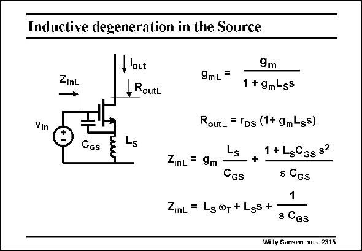

# SANSEN-2315 · Inductive degeneration in the Source

章节：23 低噪声放大器  
PDF 页：706；书本页：718；幻灯片编号：2315  
状态：unreviewed



## 对应教材讲解

### PDF 706 · 书本 718

An inductor can also be added in the Source as shown in this slide. This gives rise to a reduction of the transconductance and an increase in output resistance. The input impedance however, shows a real part L v and an imaginary part. S T The real part can be used to tune the input resistance to the source resistance R (of usually 50 V) as shown next.

## 公式／性能结论候选摘录

以下为规则截取的原文，尚未逐项判读。

- PDF 706: This gives rise to a reduction of the transconductance and an increase in output resistance.

## 曲线结论候选摘录

以下为规则截取的原文，尚未逐项判读。

（未由规则找到；不代表原页没有此类内容。）

## 原文条件与近似候选摘录

以下为规则截取的原文，尚未逐项判读。

（未由规则找到；不代表原页没有此类内容。）

## 幻灯片 OCR（未校正）

```text
Inductive degeneration in the Source
ZinL
Vin
CGs
-lout
RoutL
9mL=
9m
1 + 9m-gs
RoutL = IDs (1+ gmLss)
Ls
1 + LsGGs S2
ZinL
=
9m
°Gs
s CGs
1
ZinL = Ls®g +Lss+
s CGS
Willy Sansen 1nns 2315
```

数学上下标、分数及正负号以原图为准。电路图已保留；未核对的连接不输出成可仿真 netlist。
