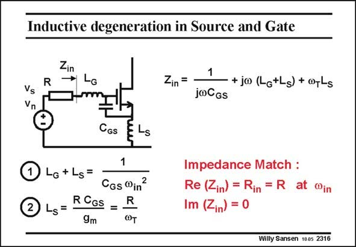

# SANSEN-2316 · Inductive degeneration in Source and Gate

章节：23 低噪声放大器  
PDF 页：707；书本页：719；幻灯片编号：2316  
状态：unreviewed



## 对应教材讲解

### PDF 707 · 书本 719

The matching of the input impedance to the source resistor R (usually 50 V) is not carried out with a resistor because it kills the Noise Figure. Normally, two inductances are used, one in the Source L and S one in the Gate L . The G latter one L is usually the G bonding wire. Both of them are used to tune out the input capacitance C , as indicated by GS the equation number one. This occurs only around the operating frequency f in (=v /2p). in Under this condition, the input impedance is purely resistive and equal to v L which is made T S equal to R. This is the design equation number two. For a given transistor (C and v , which is g /2pC ) and a given frequency f , both L GS T m GS in S and L are now determined. G How much is the gain, and the Noise Figure?

## 公式／性能结论候选摘录

以下为规则截取的原文，尚未逐项判读。

- PDF 707: This occurs only around the operating frequency f in (=v /2p). in Under this condition, the input impedance is purely resistive and equal to v L which is made T S equal to R.
- PDF 707: G How much is the gain, and the Noise Figure?

## 曲线结论候选摘录

以下为规则截取的原文，尚未逐项判读。

（未由规则找到；不代表原页没有此类内容。）

## 原文条件与近似候选摘录

以下为规则截取的原文，尚未逐项判读。

（未由规则找到；不代表原页没有此类内容。）

## 幻灯片 OCR（未校正）

```text
Inductive degeneration in Source and Gate
Zin
R
LG
Zin =
Vs
Vn
1
+jo (LotLs)+orLs
jwCGs
CGS
ELs
Lo+Ls=
1
CGs win
2 45=
RCoS =
R
9m
@T
Impedance Match :
Re (Zin) = Rin = R at in
Im (Zin) = 0
Willy Sansen 1005 2316
```

数学上下标、分数及正负号以原图为准。电路图已保留；未核对的连接不输出成可仿真 netlist。
