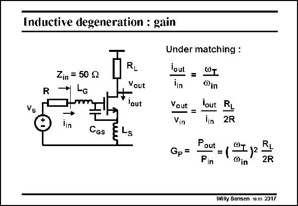

# SANSEN-2317 · Inductive degeneration : gain

章节：23 低噪声放大器  
PDF 页：707；书本页：719；幻灯片编号：2317  
状态：unreviewed



## 对应教材讲解

### PDF 707 · 书本 719

Several gains are readily calculated. The transistor model only includes the g m and C ; the output resis- GS tance r is usually a lot DS larger than R and can L therefore be neglected. In this case, and remembering the two matching conditions, the current gain is readily calculated. Also, the voltage gain is easily derived. The power gain is the product of both. It contains the v squared. A transistor T must now be taken with high v . This means that its channel length L must be made as small T as possible and its V −V high (see Chapter 1). GS T

## 公式／性能结论候选摘录

以下为规则截取的原文，尚未逐项判读。

- PDF 707: The transistor model only includes the g m and C ; the output resis- GS tance r is usually a lot DS larger than R and can L therefore be neglected.
- PDF 707: In this case, and remembering the two matching conditions, the current gain is readily calculated.
- PDF 707: Also, the voltage gain is easily derived.
- PDF 707: The power gain is the product of both.

## 曲线结论候选摘录

以下为规则截取的原文，尚未逐项判读。

（未由规则找到；不代表原页没有此类内容。）

## 原文条件与近似候选摘录

以下为规则截取的原文，尚未逐项判读。

- PDF 707: The transistor model only includes the g m and C ; the output resis- GS tance r is usually a lot DS larger than R and can L therefore be neglected.

## 幻灯片 OCR（未校正）

```text
Inductive degeneration : gain
R
Zin = 50 g
* Lc
Vs
lin
Cas
RL
Vout
lout
ELs
Under matching :
lout
WT
lin
®in
Vout
lout
=
Vin
lin
RL
2R
Gp =
Paut
=(
Pin
@Iy2
RL
®in
2R
Willy Sansen 1nns 2317
```

数学上下标、分数及正负号以原图为准。电路图已保留；未核对的连接不输出成可仿真 netlist。
