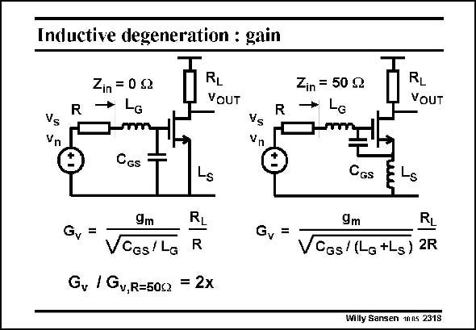

# SANSEN-2318 · Inductive degeneration : gain

章节：23 低噪声放大器  
PDF 页：708；书本页：720；幻灯片编号：2318  
状态：unreviewed



## 对应教材讲解

### PDF 708 · 书本 720

Note that the voltage gain G is different whether an v inductor L is inserted in the S Source or not. Without this inductor (on the left) the input impedance is zero. The input impedance is not matched to the antenna. With this inductor (on the right), the input impedance is purely resistive and equal to R (or 50 V). As a result, there is a division by two at the input such that the voltage gain is a factor of two smaller.

## 公式／性能结论候选摘录

以下为规则截取的原文，尚未逐项判读。

- PDF 708: Note that the voltage gain G is different whether an v inductor L is inserted in the S Source or not.
- PDF 708: With this inductor (on the right), the input impedance is purely resistive and equal to R (or 50 V).
- PDF 708: As a result, there is a division by two at the input such that the voltage gain is a factor of two smaller.

## 曲线结论候选摘录

以下为规则截取的原文，尚未逐项判读。

（未由规则找到；不代表原页没有此类内容。）

## 原文条件与近似候选摘录

以下为规则截取的原文，尚未逐项判读。

（未由规则找到；不代表原页没有此类内容。）

## 幻灯片 OCR（未校正）

```text
Inductive degeneration : gain
Vs
Vn
R
Zin = 0 g2
→ La
Im
CGs
RL
VOUT
R
Vs
Vn
®
9m
Gv
=
VCes/La
R
R
Gy / Gv,R=50c = 2x
Gv
Zin = 50 g2
La
RL
VOUT
CGs
m
-S
9m
R,
CGs/ (La +Ls) 2R
Willy Sansen 1nns 2318
```

数学上下标、分数及正负号以原图为准。电路图已保留；未核对的连接不输出成可仿真 netlist。
