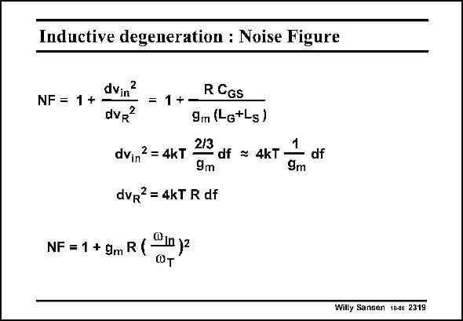

# SANSEN-2319 · Inductive degeneration : Noise Figure

章节：23 低噪声放大器  
PDF 页：708；书本页：720；幻灯片编号：2319  
状态：unreviewed



## 对应教材讲解

### PDF 708 · 书本 720

The Noise Figure NF is defined as in Chapter 4. The equivalent input noise of the input transistor is as given in this slide. The term 2/3 has been left out to take into account that this MOST is probably operating close to velocity saturation where its thermal noise is probably larger. It may help somewhat to lower the Drain-Source voltage to avoid velocity saturation. The noise of the load R L is neglected. Under the two matching conditions, the NF can then be rewritten as given in this slide. It is striking that the NF decreaes for larger values of v , but not for larger g . Parameter T m v is therefore clearly the dominant transistor parameter. T Also, note that the NF is quite low at lower frequencies, but increases versus frequency. At the highest frequencies of interest the NF may not be all that attractive.

## 公式／性能结论候选摘录

以下为规则截取的原文，尚未逐项判读。

- PDF 708: Parameter T m v is therefore clearly the dominant transistor parameter.
- PDF 708: T Also, note that the NF is quite low at lower frequencies, but increases versus frequency.

## 曲线结论候选摘录

以下为规则截取的原文，尚未逐项判读。

（未由规则找到；不代表原页没有此类内容。）

## 原文条件与近似候选摘录

以下为规则截取的原文，尚未逐项判读。

- PDF 708: The term 2/3 has been left out to take into account that this MOST is probably operating close to velocity saturation where its thermal noise is probably larger.
- PDF 708: It may help somewhat to lower the Drain-Source voltage to avoid velocity saturation.
- PDF 708: The noise of the load R L is neglected.

## 幻灯片 OCR（未校正）

```text
Inductive degeneration : Noise Figure
dvin?
NF = 1 + -
dvR?
= 1 +-
R CGs
9m (Lg+Ls)
2/3
dv,,2 = 4kT
- df = 4kT
1
9m
9m
dvR?= 4kT R df
df
NF = 1 + gm R ( *n y2
Willy Sansen 10-46 2319
```

数学上下标、分数及正负号以原图为准。电路图已保留；未核对的连接不输出成可仿真 netlist。
