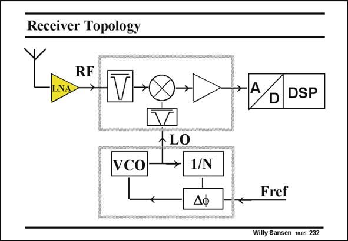

# SANSEN-232 · Receiver Topology

章节：23 低噪声放大器  
PDF 页：699；书本页：711；幻灯片编号：232  
状态：unreviewed



## 对应教材讲解

### PDF 699 · 书本 711

An example of such a receiver is shown in this slide. The LNA is the first amplifier. It is an RF amplifier followed by a mixer, which translates the modulation content to low frequencies. After some filtering, this signal is then converted in digital form, towards a DSP. The mixer needs a local oscillator, which is normally derived from a phase-locked loop (PLL). In this feedback loop a VCO generates a frequency, which is locked to an external reference frequency Fref, after a divider by N. It is clear that the LNA interacts with the antenna. This is why both the antenna output and LNA input must show a characteristic impedance, to avoid reflections. This is discussed next.

## 公式／性能结论候选摘录

以下为规则截取的原文，尚未逐项判读。

（未由规则找到；不代表原页没有此类内容。）

## 曲线结论候选摘录

以下为规则截取的原文，尚未逐项判读。

- PDF 699: The mixer needs a local oscillator, which is normally derived from a phase-locked loop (PLL).
- PDF 699: This is why both the antenna output and LNA input must show a characteristic impedance, to avoid reflections.

## 原文条件与近似候选摘录

以下为规则截取的原文，尚未逐项判读。

（未由规则找到；不代表原页没有此类内容。）

## 幻灯片 OCR（未校正）

```text
Receiver Topology
LNA
RF
→ V→x→>
>AD DSP
VCo-
→ 1/N
Fref
Willy Sansen 100s 232
```

数学上下标、分数及正负号以原图为准。电路图已保留；未核对的连接不输出成可仿真 netlist。
