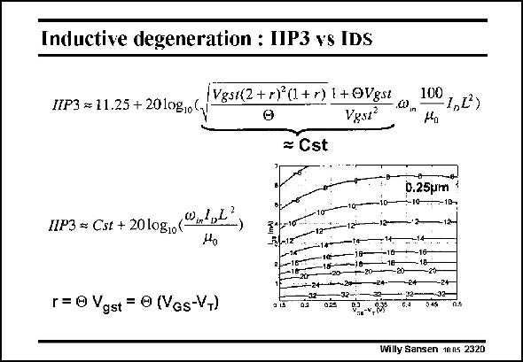

# SANSEN-2320 · Inductive degeneration : 11P3 vs IDS

章节：23 低噪声放大器  
PDF 页：709；书本页：721；幻灯片编号：2320  
状态：unreviewed



## 对应教材讲解

### PDF 709 · 书本 721

The 3rd-order intermodulation intercept point IIP3 can be calculated using the simple model of Chapter 1, in which fitting parameter h is used (or H). Because of the two derivatives to be taken, the expression is quite evolved. A plot is given of the IIP3 versus the transistor current I and its V −V . It is DS GS T striking to see that the value of V −V is not all that GS T important. The only real important parameter is the DC current I . The higher the current, the higher the IIP3. DS

## 公式／性能结论候选摘录

以下为规则截取的原文，尚未逐项判读。

（未由规则找到；不代表原页没有此类内容。）

## 曲线结论候选摘录

以下为规则截取的原文，尚未逐项判读。

- PDF 709: A plot is given of the IIP3 versus the transistor current I and its V −V .

## 原文条件与近似候选摘录

以下为规则截取的原文，尚未逐项判读。

（未由规则找到；不代表原页没有此类内容。）

## 幻灯片 OCR（未校正）

```text
Inductive degeneration : 11P3 vs IDS
IIP3 = 11.25 + 2010gio(
|Vgst(2 + r)°(1+r) | + OVgst
Vesz?
100
1,2)
= Cst
D.25pm
10-
=10-
1IP3 & CsE + 2010g10(0nl,L?
5l-12
r= © Vgst = ® (Vas-VT)
-18-
1-24-4+029
12
-32-
02
025
-24-
-10
-20-
416
-18
20-
24
u 32-.
045
Willy Sansen 1005 2320
```

数学上下标、分数及正负号以原图为准。电路图已保留；未核对的连接不输出成可仿真 netlist。
