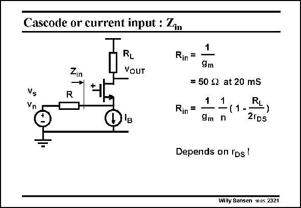

# SANSEN-2321 · Cascode or current input : Zim

章节：23 低噪声放大器  
PDF 页：709；书本页：721；幻灯片编号：2321  
状态：unreviewed



## 对应教材讲解

### PDF 709 · 书本 721

Instead of an amplifier, a cascode can be taken as well. Its advantage is that its input impedance is resistive up to high frequencies and can be set by the current. Indeed, it is the inverse transconductance. However, a closer look reveals that several other factors come in such as the parameter n (#1+g /g ), mB m and the output resistance r . They render the input DS resistance much less accurate.

## 公式／性能结论候选摘录

以下为规则截取的原文，尚未逐项判读。

（未由规则找到；不代表原页没有此类内容。）

## 曲线结论候选摘录

以下为规则截取的原文，尚未逐项判读。

（未由规则找到；不代表原页没有此类内容。）

## 原文条件与近似候选摘录

以下为规则截取的原文，尚未逐项判读。

（未由规则找到；不代表原页没有此类内容。）

## 幻灯片 OCR（未校正）

```text
Cascode or current input : Zim
Zin
RL
VOUT
Vs
Vn
R
Rin =
Rin =
B
1
9m
= 50 S2 at 20 mS
1
1
9m n
RL
(1 -
-)
21DS
Depends on iDs!
Willy Sansen 1nns 2321
```

数学上下标、分数及正负号以原图为准。电路图已保留；未核对的连接不输出成可仿真 netlist。
