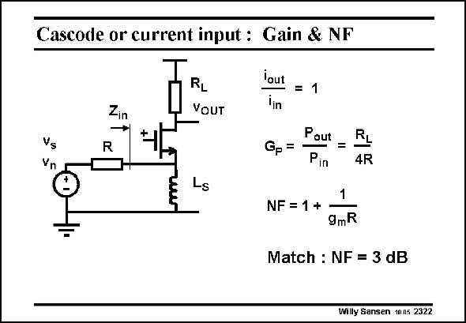

# SANSEN-2322 · Cascode or current input: Gain & NF

章节：23 低噪声放大器  
PDF 页：710；书本页：722；幻灯片编号：2322  
状态：unreviewed



## 对应教材讲解

### PDF 710 · 书本 722

If the LNA is matched, i.e. if R#1/g , then it is easily m found that the current gain is unity and the voltage and power gain are as given in this slide. It shows that the load resistor R is much (up L to ten times) larger than R. The Noise Figure is also easily derived. It is given in this slide provided the gain is large enough to neglect the noise from R . L Note that this expression yields a NF of 2 or 3 dB under matched conditions. This value is rather high but is independent of frequency. For very high frequencies this NF may even be better than for an amplifier configuration, as shown next. The linearity is always better than for an amplifier configuration because this stage is actually current driven.

## 公式／性能结论候选摘录

以下为规则截取的原文，尚未逐项判读。

- PDF 710: If the LNA is matched, i.e. if R#1/g , then it is easily m found that the current gain is unity and the voltage and power gain are as given in this slide.
- PDF 710: It is given in this slide provided the gain is large enough to neglect the noise from R .
- PDF 710: This value is rather high but is independent of frequency.

## 曲线结论候选摘录

以下为规则截取的原文，尚未逐项判读。

（未由规则找到；不代表原页没有此类内容。）

## 原文条件与近似候选摘录

以下为规则截取的原文，尚未逐项判读。

- PDF 710: It is given in this slide provided the gain is large enough to neglect the noise from R .

## 幻灯片 OCR（未校正）

```text
Cascode or current input: Gain & NF
RL
VOUT
Zin
→
R
Vs
Vn
lout
= 1
lin
Pout
Gp=
Pin
=
NF = 1 +
4R
1
9mR
Match : NF = 3 dB
Willy Sansen 1nns 2322
```

数学上下标、分数及正负号以原图为准。电路图已保留；未核对的连接不输出成可仿真 netlist。
