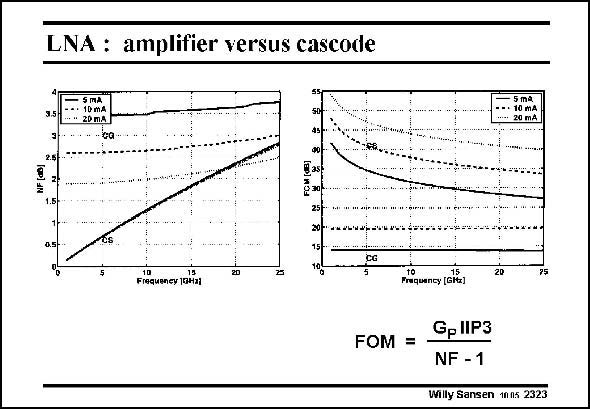

# SANSEN-2323 · LNA: amplifier versus cascode

章节：23 低噪声放大器  
PDF 页：710；书本页：722；幻灯片编号：2323  
状态：unreviewed



## 对应教材讲解

### PDF 710 · 书本 722

For sake of comparison, the Noise Figure is given for three different currents versus frequency for a standard 0.13 mm CMOS technology. In addition, a FOM is added as described in this slide. The amplifier (Common- Gate) configuration shows a NF which deteriorates when the frequency increases, which is not true for the cascode (Common Gate). For a small current (5 mA), the cascode performs better than the amplifier from about 12 GHz. This is about f /2 however, and may not be so useful. T The FOM of an amplifier is always higher than for a cascode.

## 公式／性能结论候选摘录

以下为规则截取的原文，尚未逐项判读。

- PDF 710: The amplifier (Common- Gate) configuration shows a NF which deteriorates when the frequency increases, which is not true for the cascode (Common Gate).

## 曲线结论候选摘录

以下为规则截取的原文，尚未逐项判读。

（未由规则找到；不代表原页没有此类内容。）

## 原文条件与近似候选摘录

以下为规则截取的原文，尚未逐项判读。

（未由规则找到；不代表原页没有此类内容。）

## 幻灯片 OCR（未校正）

```text
LNA: amplifier versus cascode
3.5
5 mA
$O mnA
2D m.A
sma
- - • 10 mA
20 mA
2.5
0.5
20
15
CG
75
Frequency 10Ha1
Fraquency [GHx)
FOM =
Gp IIP3
NF -1
Willy Sansen 1005 2323
```

数学上下标、分数及正负号以原图为准。电路图已保留；未核对的连接不输出成可仿真 netlist。
