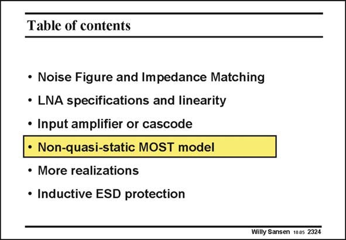

# SANSEN-2324 · Table of contents

章节：23 低噪声放大器  
PDF 页：711；书本页：723；幻灯片编号：2324  
状态：unreviewed



## 对应教材讲解

### PDF 711 · 书本 723

As LNA’s reach high frequencies, up to f /2, some T other phenomena show up. In addition to distributed capacitors, both to the substrate as between parallel lines, the distributed nature of the channel of a MOST starts playing as well. This is explained next.

## 公式／性能结论候选摘录

以下为规则截取的原文，尚未逐项判读。

（未由规则找到；不代表原页没有此类内容。）

## 曲线结论候选摘录

以下为规则截取的原文，尚未逐项判读。

（未由规则找到；不代表原页没有此类内容。）

## 原文条件与近似候选摘录

以下为规则截取的原文，尚未逐项判读。

（未由规则找到；不代表原页没有此类内容。）

## 幻灯片 OCR（未校正）

```text
Table of contents
• Noise Figure and Impedance Matching
• LNA specifications and linearity
• Input amplifier or cascode
• Non-quasi-static MOST model
• More realizations
• Inductive ESD protection
Willy Sansen 1005 2324
```

数学上下标、分数及正负号以原图为准。电路图已保留；未核对的连接不输出成可仿真 netlist。
