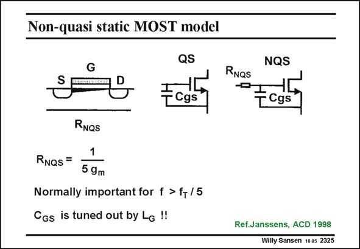

# SANSEN-2325 · Non-quasi static MOST model

章节：23 低噪声放大器  
PDF 页：711；书本页：723；幻灯片编号：2325  
状态：unreviewed



## 对应教材讲解

### PDF 711 · 书本 723

In a classical quasi-static model of a MOST, we assume that any change in Gate voltage is followed by an instantaneous change in channel charge. In practice, there is some delay, however. To change the charge in the channel, or in the inversion layer, carriers must be drawn from Source and Drain, which takes time. In order to model this time delay to a first degree, a low-pass filter is added at the Gate. It is realized by addition of a resistor R , which forms a low-pass filter with input NQS capacitance C . GS The value of this resistor R must be about 1/5g (see Chapter 1, Tsividis 1987). NQS m Clearly, this effect is important for really high frequencies, higher than f /5. LNA’s and VCO’s T operate up to frequencies of f /3, however. This effect must now be taken into account if precise T predictions are important. Also, if an inductor is added in series with the Gate, then the effect of this resistor is even more important.

## 公式／性能结论候选摘录

以下为规则截取的原文，尚未逐项判读。

（未由规则找到；不代表原页没有此类内容。）

## 曲线结论候选摘录

以下为规则截取的原文，尚未逐项判读。

（未由规则找到；不代表原页没有此类内容。）

## 原文条件与近似候选摘录

以下为规则截取的原文，尚未逐项判读。

- PDF 711: In a classical quasi-static model of a MOST, we assume that any change in Gate voltage is followed by an instantaneous change in channel charge.

## 幻灯片 OCR（未校正）

```text
Non-quasi static MOST model
G
QS
TCgs*
NQS
RNQs
"Ectt
RNQs
1
RNas =
5 9m
Normally important for f > f+/ 5
CGs is tuned out by Le !!
Ref.Janssens, ACD 1998
Willy Sansen 1005 2325
```

数学上下标、分数及正负号以原图为准。电路图已保留；未核对的连接不输出成可仿真 netlist。
