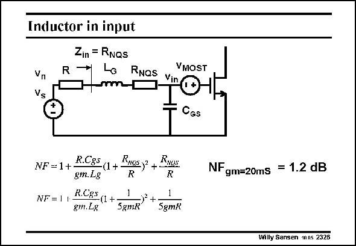

# SANSEN-2326 · Inductor in input Zin = RNQs

章节：23 低噪声放大器  
PDF 页：712；书本页：724；幻灯片编号：2326  
状态：unreviewed



## 对应教材讲解

### PDF 712 · 书本 724

This additional resistance R in series with the Gate NQS deteriorates the NF as shown in this slide. As a resistance 1/5g is taken. m It is a single-MOST amplifier with only a Gate inductor. Several terms have to be added to the Noise Figure. The most important one is the term which is squared. Note that the input impedance is no more zero but equal to this resistance R . NQS

## 公式／性能结论候选摘录

以下为规则截取的原文，尚未逐项判读。

- PDF 712: Note that the input impedance is no more zero but equal to this resistance R .

## 曲线结论候选摘录

以下为规则截取的原文，尚未逐项判读。

（未由规则找到；不代表原页没有此类内容。）

## 原文条件与近似候选摘录

以下为规则截取的原文，尚未逐项判读。

（未由规则找到；不代表原页没有此类内容。）

## 幻灯片 OCR（未校正）

```text
Inductor in input
Zin = RNQs
Vn
Vs
R
VMOST
→ Lo RNaS yIO
CGS
NF=1+ R.C8S(1+ Rnesy? + RxoN:
gm.Lg
NF=1
R.CSS (1+
gm.Lg
5gME)* +
5gmk
NFgm=20ms = 1.2 dB
Willy Sansen 1nns 2326
```

数学上下标、分数及正负号以原图为准。电路图已保留；未核对的连接不输出成可仿真 netlist。
