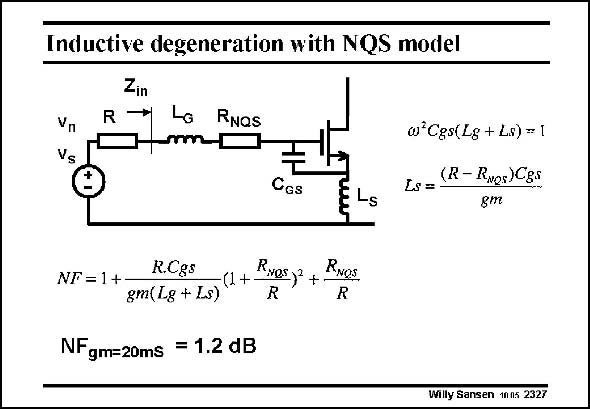

# SANSEN-2327 · Inductive degeneration with NQS model

章节：23 低噪声放大器  
PDF 页：712；书本页：724；幻灯片编号：2327  
状态：unreviewed



## 对应教材讲解

### PDF 712 · 书本 724

When two inductors are used, the addition of the NQS resistor influences the matching equations. The first one (on top right) is about the tuning out of capacitor C , and is the GS same as before. The second one however, includes R , such that a NQS smaller value of L is S obtained. The Noise Figure will be worse, as an additional resistor R is present in NQS series with the Gate of the amplifier. In its simplest approximation, the R simply has to be added to source resistor R. NQS The most important addition however, is the factor which is squared.

## 公式／性能结论候选摘录

以下为规则截取的原文，尚未逐项判读。

（未由规则找到；不代表原页没有此类内容。）

## 曲线结论候选摘录

以下为规则截取的原文，尚未逐项判读。

（未由规则找到；不代表原页没有此类内容。）

## 原文条件与近似候选摘录

以下为规则截取的原文，尚未逐项判读。

- PDF 712: In its simplest approximation, the R simply has to be added to source resistor R.

## 幻灯片 OCR（未校正）

```text
Inductive degeneration with NQS model
Zin
1→ Lo RNos
Vn
Vs
w'Cgs(Lg + Ls) = 1
LS= (R- RNos)CEs
gm
Ces
E Ls
R.Cgs
NF = 1 +
-(1+ RNas)2 +.
RNOS.
gm(Lg + Ls)
R
NF gm=20ms = 1.2 dB
Willy Sansen 1mns 2327
```

数学上下标、分数及正负号以原图为准。电路图已保留；未核对的连接不输出成可仿真 netlist。
