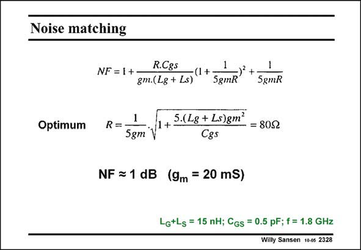

# SANSEN-2328 · Noise matching

章节：23 低噪声放大器  
PDF 页：713；书本页：725；幻灯片编号：2328  
状态：unreviewed



## 对应教材讲解

### PDF 713 · 书本 725

This LNA can now be further optimized, taking into account this R . First of NQS all this R is substituted NQS by 1/5g . Then the optim mum value of R can be found, as a function of g . m The value of R is slightly higher than 50 V but the NF is lower than before.

## 公式／性能结论候选摘录

以下为规则截取的原文，尚未逐项判读。

（未由规则找到；不代表原页没有此类内容。）

## 曲线结论候选摘录

以下为规则截取的原文，尚未逐项判读。

（未由规则找到；不代表原页没有此类内容。）

## 原文条件与近似候选摘录

以下为规则截取的原文，尚未逐项判读。

（未由规则找到；不代表原页没有此类内容。）

## 幻灯片 OCR（未校正）

```text
Noise matching
Optimum
NF = 1+ -
R.C85
1
-(1+-
-) +
gm.(Lg + Ls)
5gmR
SgmR
1
R=-
5gm
1+-
5.(L8 + Ls)gm'
- = 809
Cgs
NF = 1 dB (9m = 20 ms)
Lg+Lg = 15 nH; CGs = 0.5 pF; f = 1.8 GHz
Wilty Sansen 100s 2328
```

数学上下标、分数及正负号以原图为准。电路图已保留；未核对的连接不输出成可仿真 netlist。
