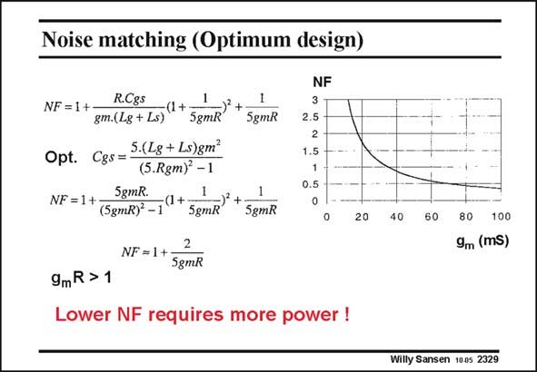

# SANSEN-2329 · Noise matching (Optimum design)

章节：23 低噪声放大器  
PDF 页：713；书本页：725；幻灯片编号：2329  
状态：unreviewed



## 对应教材讲解

### PDF 713 · 书本 725

Further optimization shows that now the transistor size has to be adapted as well, giving a different value for C . GS The expression of the NF has now become very simple now. It is the lowest value possible. It is obvious that lower values of NF can only be obtained, provided higher g values are obtained, and m hence more power. A plot of this expression is also given. The larger the transconductance, the lower the NF. For 1 dB Noise Figure, about 33 mS transconductance is required.

## 公式／性能结论候选摘录

以下为规则截取的原文，尚未逐项判读。

（未由规则找到；不代表原页没有此类内容。）

## 曲线结论候选摘录

以下为规则截取的原文，尚未逐项判读。

- PDF 713: A plot of this expression is also given.

## 原文条件与近似候选摘录

以下为规则截取的原文，尚未逐项判读。

- PDF 713: It is obvious that lower values of NF can only be obtained, provided higher g values are obtained, and m hence more power.

## 幻灯片 OCR（未校正）

```text
Noise matching (Optimum design)
NF = 1+
R.Cgs
•(1+
gm.(L8 + Ls)
5gmR
Opt.
C8s = 5.(L8 + Ls)gm
(5.Rgm) -1
NF = 1 +
5gmR.
(1+
(5gmR)* -1
5gmR
2
NF=1+
5gmR
5gmR
5gmR
NF
2.5
2
1.5
0.5
20
9mR >1
Lower NF requires more power !
40
60
80
100
9m (mS)
Willy Sansen 1005 2329
```

数学上下标、分数及正负号以原图为准。电路图已保留；未核对的连接不输出成可仿真 netlist。
