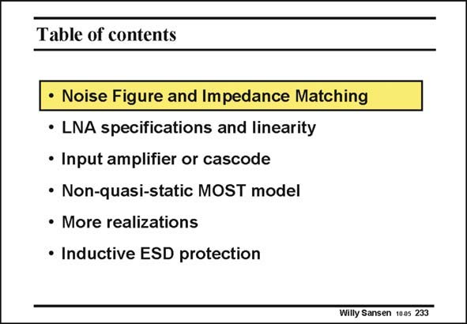

# SANSEN-233 · Table of contents

章节：23 低噪声放大器  
PDF 页：700；书本页：712；幻灯片编号：233  
状态：unreviewed



## 对应教材讲解

### PDF 700 · 书本 712

Two of the most important characteristics of a LNA is the noise performance within the constraints of impedance matching. This is why they are discussed first. Some attention is now paid to the linearity of a LNA, as large input signals are as common as small ones. A comparison follows between the most popular configurations. The first has an amplifier (Common- Source Configuration) at the input whereas the second has a cascode (Common-Gate Configuration). MOST transistors can exhibit non-quasi-static behavior at high frequencies. We have to investigate when this effect is important. Finally, a large number of configurations are discussed, including components for electrostaticdischarge protection.

## 公式／性能结论候选摘录

以下为规则截取的原文，尚未逐项判读。

（未由规则找到；不代表原页没有此类内容。）

## 曲线结论候选摘录

以下为规则截取的原文，尚未逐项判读。

- PDF 700: Two of the most important characteristics of a LNA is the noise performance within the constraints of impedance matching.

## 原文条件与近似候选摘录

以下为规则截取的原文，尚未逐项判读。

（未由规则找到；不代表原页没有此类内容。）

## 幻灯片 OCR（未校正）

```text
Table of contents
• Noise Figure and Impedance Matching
• LNA specifications and linearity
• Input amplifier or cascode
• Non-quasi-static MOST model
• More realizations
• Inductive ESD protection
Willy Sansen 100s 233
```

数学上下标、分数及正负号以原图为准。电路图已保留；未核对的连接不输出成可仿真 netlist。
