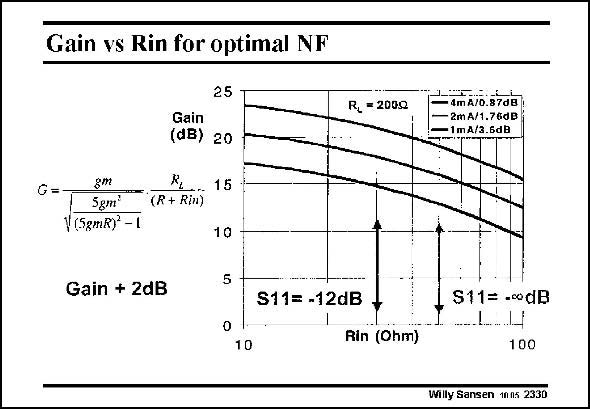

# SANSEN-2330 · Gain vs Rin for optimal NF

章节：23 低噪声放大器  
PDF 页：714；书本页：726；幻灯片编号：2330  
状态：unreviewed



## 对应教材讲解

### PDF 714 · 书本 726

This optimization illustrates the compromises to be taken. For a constant load resistor R , the gain is given for L different currents, causing at the same time, deviations for the ideal input matching conditions. For a 50 V input resistance, the s is zero. The 11 gain then increases with the current. Taking a slightly smaller input resistance however, increases the s to −12 dB 11 but gives about 2 dB more gain. This is clearly advantageous provided some reflection (−12 dB s ) can be allowed. 11

## 公式／性能结论候选摘录

以下为规则截取的原文，尚未逐项判读。

- PDF 714: For a constant load resistor R , the gain is given for L different currents, causing at the same time, deviations for the ideal input matching conditions.
- PDF 714: The 11 gain then increases with the current.
- PDF 714: Taking a slightly smaller input resistance however, increases the s to −12 dB 11 but gives about 2 dB more gain.

## 曲线结论候选摘录

以下为规则截取的原文，尚未逐项判读。

（未由规则找到；不代表原页没有此类内容。）

## 原文条件与近似候选摘录

以下为规则截取的原文，尚未逐项判读。

- PDF 714: This is clearly advantageous provided some reflection (−12 dB s ) can be allowed. 11

## 幻灯片 OCR（未校正）

```text
Gain vs Rin for optimal NF
25
Gain
(dB) 20
G=
gm
... 15
5gm'
"*(R+ Rim
V (5gmR) -1
10
Gain + 2dB
5
S11= -12dB
0
R, =2000
—ImA/0.87d5
- 2mA/1.76₫B
1mA/3.6dB
10
Rin (0hm)
S11= -codB
100
Willy Sansen 10ns 2330
```

数学上下标、分数及正负号以原图为准。电路图已保留；未核对的连接不输出成可仿真 netlist。
