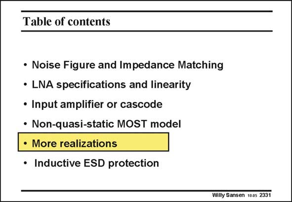

# SANSEN-2331 · Table of contents

章节：23 低噪声放大器  
PDF 页：714；书本页：726；幻灯片编号：2331  
状态：unreviewed



## 对应教材讲解

### PDF 714 · 书本 726

Now that the design equations have been identified for low-noise LNA’s, taking into account Non-quasistatic effects, we focus on some realizations. It is clear that the configurations only differ a small amount. The transistor sizes and currents however, are largely different depending on the frequencies. Also, the sizes of the inductors which are added, can be very different.

## 公式／性能结论候选摘录

以下为规则截取的原文，尚未逐项判读。

- PDF 714: The transistor sizes and currents however, are largely different depending on the frequencies.

## 曲线结论候选摘录

以下为规则截取的原文，尚未逐项判读。

（未由规则找到；不代表原页没有此类内容。）

## 原文条件与近似候选摘录

以下为规则截取的原文，尚未逐项判读。

（未由规则找到；不代表原页没有此类内容。）

## 幻灯片 OCR（未校正）

```text
Table of contents
• Noise Figure and Impedance Matching
• LNA specifications and linearity
• Input amplifier or cascode
• Non-quasi-static MOST model
• More realizations
• Inductive ESD protection
Willy Sansen 1005 2331
```

数学上下标、分数及正负号以原图为准。电路图已保留；未核对的连接不输出成可仿真 netlist。
