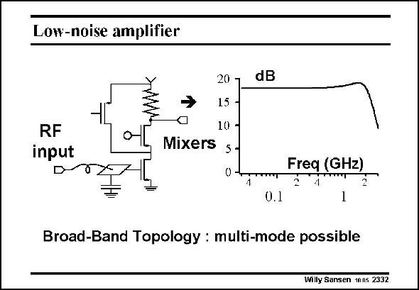

# SANSEN-2332 · Low-noise amplifier

章节：23 低噪声放大器  
PDF 页：715；书本页：727；幻灯片编号：2332  
状态：unreviewed



## 对应教材讲解

### PDF 715 · 书本 727

Our overview starts with a very simple LNA.A cascode is used to improve the isolation between output and input. This is especially required to avoid leakage from the next block, which is usually a mixer, to the input of the LNA. In order to avoid noise coming from the cascode, its DC current is reduced. A current source with pMOST, provides some of the DC current to the input transistor. In this way, the contribution of the noise of the load devices can be reduced somewhat. At the input, the bond-wire is shown. It is used to tune out the effect of the input MOST capacitance and of the bonding pad capacitance.

## 公式／性能结论候选摘录

以下为规则截取的原文，尚未逐项判读。

（未由规则找到；不代表原页没有此类内容。）

## 曲线结论候选摘录

以下为规则截取的原文，尚未逐项判读。

（未由规则找到；不代表原页没有此类内容。）

## 原文条件与近似候选摘录

以下为规则截取的原文，尚未逐项判读。

（未由规则找到；不代表原页没有此类内容。）

## 幻灯片 OCR（未校正）

```text
Low-noise amplifier
RF
input
20 1
15 -
10 -
Mixers
5-
0-4
dB
Freq (GHz)
0.1
Broad-Band Topology : multi-mode possible
Willy Sansen 10n5 2332
```

数学上下标、分数及正负号以原图为准。电路图已保留；未核对的连接不输出成可仿真 netlist。
