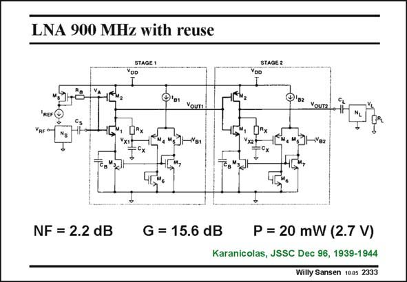

# SANSEN-2333 · LNA 900 MHz with reuse

章节：23 低噪声放大器  
PDF 页：715；书本页：727；幻灯片编号：2333  
状态：unreviewed



## 对应教材讲解

### PDF 715 · 书本 727

This LNA consists of two equal stages. The input transistors M1 and M2 are connected as a common CMOS inverter amplifier. Both of them contribute to the transconductance. The current in the nMOST is now reused in the pMOST. However, the biasing current of a CMOS inverter amplifier heavily depends on the supply voltage. This problem is solved here by a biasing block consisting of transistors M3-M7. This block provides DC feedback such that the DC output voltage equals V for the first LNA. It is fully decoupled from the AC operation by means of two decoupling B1 capacitors C and C . B X At the input a matching network N is provided. S

## 公式／性能结论候选摘录

以下为规则截取的原文，尚未逐项判读。

- PDF 715: This LNA consists of two equal stages.
- PDF 715: However, the biasing current of a CMOS inverter amplifier heavily depends on the supply voltage.
- PDF 715: This block provides DC feedback such that the DC output voltage equals V for the first LNA.

## 曲线结论候选摘录

以下为规则截取的原文，尚未逐项判读。

（未由规则找到；不代表原页没有此类内容。）

## 原文条件与近似候选摘录

以下为规则截取的原文，尚未逐项判读。

- PDF 715: B X At the input a matching network N is provided.

## 幻灯片 OCR（未校正）

```text
LNA 900 MHz with reuse
OUTA
Yourz!
REF
VRF
-B2
NF = 2.2 dB
G = 15.6 dB
P = 20 mW (2.7 V)
Karanicolas, JSSC Dec 96, 1939-1944
Willy Sansen 1005 2333
```

数学上下标、分数及正负号以原图为准。电路图已保留；未核对的连接不输出成可仿真 netlist。
