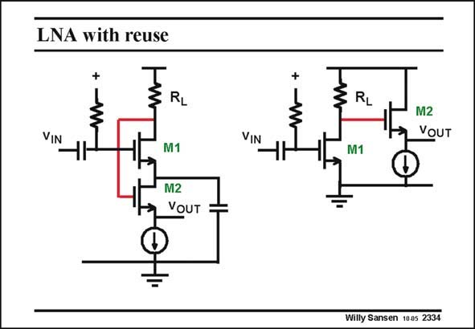

# SANSEN-2334 · LNA with reuse

章节：23 低噪声放大器  
PDF 页：716；书本页：728；幻灯片编号：2334  
状态：unreviewed



## 对应教材讲解

### PDF 716 · 书本 728

Current reuse can also be effectuated in another way. If a two-stage amplifier is required, or an amplifier followed by a source follower, then current is used twice, as shown on the right. However, a judicious set of capacitors allows limiting the current to just one single path. This is shown on the left. Transistor M1 sees a signal ground at its Source. Its output is coupled to the Source follower underneath. The same technique is used three times in the following LNA.

## 公式／性能结论候选摘录

以下为规则截取的原文，尚未逐项判读。

- PDF 716: However, a judicious set of capacitors allows limiting the current to just one single path.

## 曲线结论候选摘录

以下为规则截取的原文，尚未逐项判读。

（未由规则找到；不代表原页没有此类内容。）

## 原文条件与近似候选摘录

以下为规则截取的原文，尚未逐项判读。

（未由规则找到；不代表原页没有此类内容。）

## 幻灯片 OCR（未校正）

```text
LNA with reuse
VIN
RL
M1
M2
→ YOUT
VIN
RL
M1
M2
VOUT
Willy Sansen 1005 2334
```

数学上下标、分数及正负号以原图为准。电路图已保留；未核对的连接不输出成可仿真 netlist。
