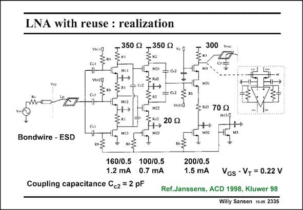

# SANSEN-2335 · LNA with reuse : realization

章节：23 低噪声放大器  
PDF 页：716；书本页：728；幻灯片编号：2335  
状态：unreviewed



## 对应教材讲解

### PDF 716 · 书本 728

In this LNA, three input nMOSTs M11-M13 are placed in parallel to increase the transconductance. They all share the same DC current, however. The outputs are placed in parallel two by two and applied to a second stage with transistors M21– M22. The same method is then applied in the second stage. Their two outputs are put in parallel again and applied to a third amplifier stage with transistor M31, which provides the output voltage through cascode transistor M4. The DC biasing is applied by means of current mirrors M5 and M13, M23 and M32. The transistor sizes, currents and resistors are all given in this slide. The resulting specifications are given next.

## 公式／性能结论候选摘录

以下为规则截取的原文，尚未逐项判读。

- PDF 716: In this LNA, three input nMOSTs M11-M13 are placed in parallel to increase the transconductance.

## 曲线结论候选摘录

以下为规则截取的原文，尚未逐项判读。

（未由规则找到；不代表原页没有此类内容。）

## 原文条件与近似候选摘录

以下为规则截取的原文，尚未逐项判读。

（未由规则找到；不代表原页没有此类内容。）

## 幻灯片 OCR（未校正）

```text
LNA with reuse : realization
350 g
VNI ED
.350 g2
Vc Q
300
M:E
V013g
Ccl
ca
MIZ
M2!
2.02
H
* R2|
M22
ca
м3:
C2
Cet
20 S2
MIЗ
M23|
ZRas 70 Q
+→
M32
Bondwire - ESD
160/0.5 100/0.5
1.2 mA 0.7 mA
Coupling capacitance Cc2 = 2 pF
200/0.5
1.5 mA
VGs - V+ = 0.22 V
Ref.Janssens, ACD 1998, Kluwer 98
Willy Sansen 10-es 2335
```

数学上下标、分数及正负号以原图为准。电路图已保留；未核对的连接不输出成可仿真 netlist。
