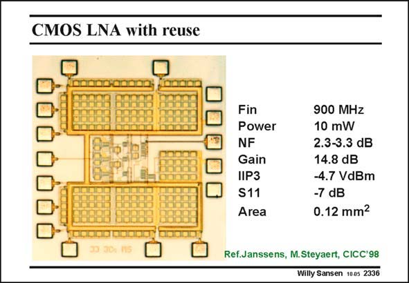

# SANSEN-2336 · CMOS LNA with reuse

章节：23 低噪声放大器  
PDF 页：717；书本页：729；幻灯片编号：2336  
状态：unreviewed



## 对应教材讲解

### PDF 717 · 书本 729

The actual gain is 14.8 dB, which is relatively high. The NF is quite reasonable for this power consumption. The layout shows the large area taken up by the decoupling capacitance. As this LNA has a single-ended input, it easily picks up noise from the ground and supply lines. A decoupling capacitance at the supply line is therefore mandatory.

## 公式／性能结论候选摘录

以下为规则截取的原文，尚未逐项判读。

- PDF 717: The actual gain is 14.8 dB, which is relatively high.
- PDF 717: A decoupling capacitance at the supply line is therefore mandatory.

## 曲线结论候选摘录

以下为规则截取的原文，尚未逐项判读。

（未由规则找到；不代表原页没有此类内容。）

## 原文条件与近似候选摘录

以下为规则截取的原文，尚未逐项判读。

（未由规则找到；不代表原页没有此类内容。）

## 幻灯片 OCR（未校正）

```text
CMOS LNA with reuse
Fin
Power
NF
Gain
IIP3
S11
Area
900 MHz
10 mW
2.3-3.3 dB
14.8 dB
-4.7 VdBm
-7 dB
0.12 mm2
Ref.Janssens, M.Steyaert, CICC'98
Willy Sansen 1005 2336
```

数学上下标、分数及正负号以原图为准。电路图已保留；未核对的连接不输出成可仿真 netlist。
