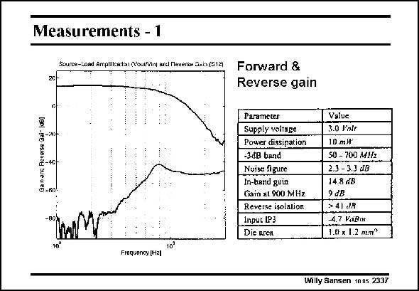

# SANSEN-2337 · Measurements - 1

章节：23 低噪声放大器  
PDF 页：717；书本页：729；幻灯片编号：2337  
状态：unreviewed



## 对应教材讲解

### PDF 717 · 书本 729

The measurements show that the gain and reverse isolation are quite good indeed. The bandwidth is less than expected, 700 MHz instead of 900 MHz.

## 公式／性能结论候选摘录

以下为规则截取的原文，尚未逐项判读。

- PDF 717: The measurements show that the gain and reverse isolation are quite good indeed.
- PDF 717: The bandwidth is less than expected, 700 MHz instead of 900 MHz.

## 曲线结论候选摘录

以下为规则截取的原文，尚未逐项判读。

（未由规则找到；不代表原页没有此类内容。）

## 原文条件与近似候选摘录

以下为规则截取的原文，尚未逐项判读。

（未由规则找到；不代表原页没有此类内容。）

## 幻灯片 OCR（未校正）

```text
Measurements - 1
Source-Load Ampfillca:lsn (Vout/Vinj anJ Neverse Scia (912)
Ga nans Rerorsa Qai-
-*X
-40)
-60
Frequency [H2l
10'
Forward &
Reverse gain
Parameter
Supply voltage
Power dissipation
-3đB band
Noise figure
In-band guin
Gain at 900 MHz
Reverse isolation
Input IP3
Dic nrcH
Value
3.0 Vale
10 mИ
S0 - 700 MH2
2.3 - 3.3 ₫B
14.8 dB
2 dB
> 4| JR
4.7 VaBoi
1.07 x 1.2 лет?
Willy Sansen 1005 2337
```

数学上下标、分数及正负号以原图为准。电路图已保留；未核对的连接不输出成可仿真 netlist。
