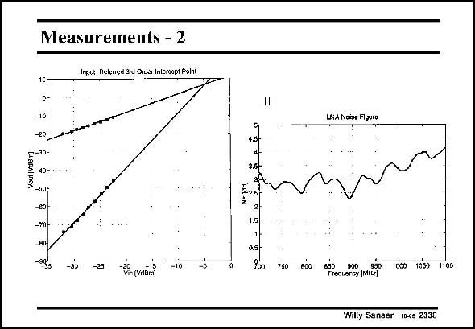

# SANSEN-2338 · Measurements - 2

章节：23 低噪声放大器  
PDF 页：718；书本页：730；幻灯片编号：2338  
状态：unreviewed



## 对应教材讲解

### PDF 718 · 书本 730

The IIP3 and Noise Figure are shown. For the IIP3 the gain is measured and the 3rd-order intermodulation distortion. The extrapolated curves meet at an input signal level of about −4.7 dBm. This is a normal value for a MOST input, which has a V −V GS T of only 0.22 V. The Noise Figure is not that flat but is never much higher than 3 dB up to 900 MHz. In this LNA, the ESD protection is not part of the design procedure. A better approach is given next.

## 公式／性能结论候选摘录

以下为规则截取的原文，尚未逐项判读。

- PDF 718: For the IIP3 the gain is measured and the 3rd-order intermodulation distortion.

## 曲线结论候选摘录

以下为规则截取的原文，尚未逐项判读。

- PDF 718: The extrapolated curves meet at an input signal level of about −4.7 dBm.

## 原文条件与近似候选摘录

以下为规则截取的原文，尚未逐项判读。

（未由规则找到；不代表原页没有此类内容。）

## 幻灯片 OCR（未校正）

```text
Measurements - 2
Irpet Deleried 3re Oiuler Intercopt Polnt
--10
:-40
-B0
-74
eD
-15
Vin (vabr
4,5-
3.6
225
=
760
LNA Noize Fiuuro
Hiaary MFEO 10SO 1600 1100
Willy Sansen 10-4s 2338
```

数学上下标、分数及正负号以原图为准。电路图已保留；未核对的连接不输出成可仿真 netlist。
