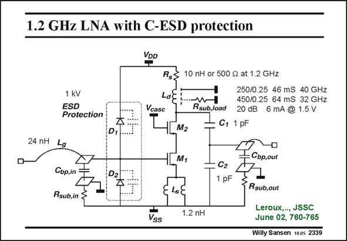

# SANSEN-2339 · 1.2 GHz LNA with C-ESD protection

章节：23 低噪声放大器  
PDF 页：718；书本页：730；幻灯片编号：2339  
状态：unreviewed



## 对应教材讲解

### PDF 718 · 书本 730

This LNA is matched to 50 Ohms at both input and output. The supply voltage is 1.5 V. At the input, it is an amplifier using inductive source degeneration for input matching. The source inductor L is implemented s as two parallel bonding wires. It also uses a cascode transistor. At the input, L is the g input bonding wire which serves as the inductor for input resonance. To the right of that we have the input bonding pad which has been especially designed, as will be explained further. It basically consists of only the top metal layer. The bottom metal layer serves to shield the pad from the substrate and increase its Quality factor. After that we have the ESD-protection diodes. The upper diode conducts the ESD-charge in case of a positive pulse vs. V . The lower diode DD operates in case of a negative pulse vs. ground. The output features a load inductor L with its series resistance, R . This inductor is impled s mented on-chip and has a patterned ground shield beneath to shield it from the substrate. The 50 Ohms output is ensured through the use of a capacitive divider made up of C and C . The 1 2 output bonding pad also takes part in the matching as it is just in parallel to C . Also, this 2 bonding pad has been shielded from the substrate in order to increase coupling through the substrate which would degrade the reverse isolation. It also ensures a fixed and known value for the pad capacitance.

## 公式／性能结论候选摘录

以下为规则截取的原文，尚未逐项判读。

- PDF 718: The bottom metal layer serves to shield the pad from the substrate and increase its Quality factor.
- PDF 718: Also, this 2 bonding pad has been shielded from the substrate in order to increase coupling through the substrate which would degrade the reverse isolation.

## 曲线结论候选摘录

以下为规则截取的原文，尚未逐项判读。

（未由规则找到；不代表原页没有此类内容。）

## 原文条件与近似候选摘录

以下为规则截取的原文，尚未逐项判读。

（未由规则找到；不代表原页没有此类内容。）

## 幻灯片 OCR（未校正）

```text
1.2 GHz LNA with C-ESD protection
1 kV
ESD
Protection
Vcasc
24 nH
D,-
Rg:
10 nH or 500 S at 1.2 GHz
250/0.25 46 mS 40 GHz
Rsub,lodd
450/0.25 64 mS 32 GHz
20 dB 6 mA @ 1.5 V
C1 1 pF
M2
Lg
Cop,in
Rsub,in
M,
Cг
1 pF
: Cbp,out
1.2 nH
Vss
Rsub,out
Leroux,.., JSSC
June 02, 760-765
Willy Sansen 1005 2339
```

数学上下标、分数及正负号以原图为准。电路图已保留；未核对的连接不输出成可仿真 netlist。
