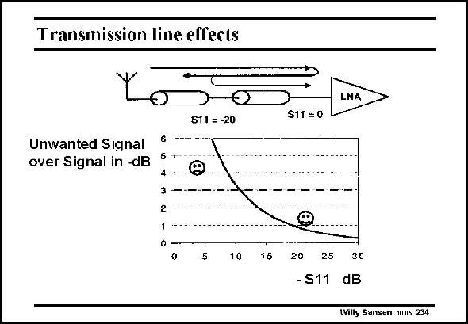

# SANSEN-234 · Transmission line effects

章节：23 低噪声放大器  
PDF 页：700；书本页：712；幻灯片编号：234  
状态：unreviewed



## 对应教材讲解

### PDF 700 · 书本 712

A voltage wave traveling along a transmission line will be partially reflected at the end of this line if the termination impedance is different from the line impedance. This reflected or unwanted signal is zero if the termination is perfect. Parameter s gives the 11 amount of reflected signal to the input signal; it is therefore minus infinity. This is only true if the input impedance of the LNA is exactly the same as the characteristic impedance of the (transmission) line, which is usually 50 V. For slight deviations, reflection occurs and s is not minus infinity any more. For example, if 11 the reflected signal is −3 dB compared to the sign l itself, then s is only about −10 dB. 11 Values of s up to −10 dB are acceptable for LNA’s, although higher values are preferred. 11 This impedance matching obviously applies to the antenna. An example is given in this slide of an LNA with high input impedance (as for MOST) and antenna which exhibits about 50 V;

### PDF 701 · 书本 713

its s is −20 dB. It is clear that reflections will especially occur at the LNA input and less at 11 the antenna terminal.

## 公式／性能结论候选摘录

以下为规则截取的原文，尚未逐项判读。

- PDF 700: Parameter s gives the 11 amount of reflected signal to the input signal; it is therefore minus infinity.

## 曲线结论候选摘录

以下为规则截取的原文，尚未逐项判读。

- PDF 700: This is only true if the input impedance of the LNA is exactly the same as the characteristic impedance of the (transmission) line, which is usually 50 V.

## 原文条件与近似候选摘录

以下为规则截取的原文，尚未逐项判读。

（未由规则找到；不代表原页没有此类内容。）

## 幻灯片 OCR（未校正）

```text
Transmission line effects
S11 = -20
Unwanted Signal
over Signal in -dB
2
5
10
15
LNA
S11 = 0
20
25
30
-S11 dB
Willy Sansen 10n5 234
```

数学上下标、分数及正负号以原图为准。电路图已保留；未核对的连接不输出成可仿真 netlist。
